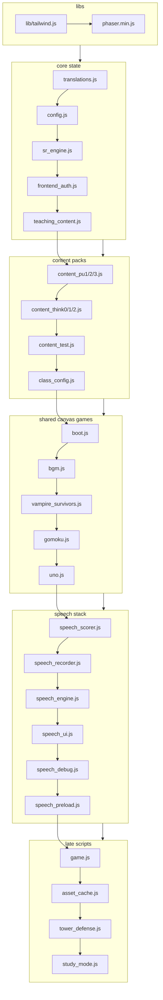

# Project Structure & File Map

> **Last verified:** 2026-09-25 · **Part of:** [Classroom-survivors Repo Wiki](README.md)

**Owner files:** `index.html`, `package.json`, `.github/workflows/azure-static-web-apps-brave-bush-0438ab000.yml`, `AGENTS.md`

One vanilla-JS + Phaser ESL learning game. **No build step**: `index.html` loads every script
directly with a `?v=` cache-buster; files share state through the global JS namespace
(no modules, no bundler). Line counts below are `wc -l` counts measured on the working tree
(2026-09-04) — expect drift as files change; treat them as magnitude, not contract.

---

## 1. Repo root at a glance

| Group | Contents |
|---|---|
| Entry & config | `index.html`, `config.js`, `boot.js`, `class_config.js` |
| Auth / sessions | `frontend_auth.js`, `teaching_content.js` (holds auth+analytics globals), `sw.js` |
| Teaching content | `teaching_content.js`, `content_pu1/2/3.js`, `content_think0/1/2.js`, `content_test.js` |
| Game modes | `vampire_survivors.js`, `gomoku.js`, `uno.js`, `tower_defense.js`, `game.js`, `study_mode.js` |
| Speech stack | `sr_engine.js`, `speech_preload.js`, `speech_recorder.js`, `speech_engine.js`, `speech_scorer.js`, `speech_ui.js`, `speech_debug.js` |
| Dashboards | `teacher_dashboard.html/.js/.css`, `admin_dashboard.js` |
| Assets & media | `asset_cache.js`, `bgm.js`, `audio_mp3/`, `music/`, `sfx/`, `images/`, `sprites/`, `fonts/`, `models/` |
| Self-hosted libs | `lib/` (tailwind.js, fontawesome, transformers.min.js, wasm), `phaser.min.js` |
| Tests | `test_*.js` (root), `vs_*.js` (VS asset/test tools), `boot_refactor_test*.js` |
| Asset tooling | `gen_missing_audio.js`, `gen_pair_images.js`, `slice_vocab_sheet.js`, `fetch_selfhost_assets.js`, `extract_*.js`, `reorganize_translations.js`, `insert_translations.py`, `check_missing_audio.py`, `verify_all.py` |
| TD tools (one-off) | `td_fix_alpha.js`, `td_slice_parts.js`, `td_verify*.js`, `tmp_gif_frames.js` |
| Backend | `api/` (Azure Functions v4), `staticwebapp.config.json`, `.nojekyll` |
| Docs / handoffs | `AGENTS.md`, `DEPLOY_VERSION_STAMP.md`, `SESSION_REFRESH_ROOTCAUSE_2026-08-25.md`, `HANDOFF_SESSION_REFRESH_FIX.md`, `HANDOFF_SESSION_FIX_FULL.md`, `PROJECT_HANDOFF_2026-07-29.md`, `PROJECT_STATE_HANDOFF.md`, `SECURITY_AUDIT_HANDOFF.md`, `TD_HANDOFF_QODERCN.md`, `MINIGAME_TIMER_FEATURES.md`, `boot_refactor_plan.md`, `TEACHING_CONTENT_*.md`, `docs/` |

## 2. Annotated file map (root)

### Core boot / config

| File | ~Lines | Role |
|---|---|---|
| `index.html` | 900 | Entry page: all overlays/menus (auth screens, dashboard, minigame containers), Tailwind via self-hosted `lib/tailwind.js`, loads Phaser then every game/auth script (load order below). Also holds the School Defense 3D menu-gate inline script (~888). |
| `config.js` | 69 | Central API config: `API_BASE_URL` (localhost:7074 in dev, else the Azure SWA Functions URL), `getAppKey()` (fetches git-ignored `app-config.json`), runtime `TD_ENABLED` / `THREE_TD_ENABLED` gating (preview-path or localhost/file:// only; `?td=`/`?3d=` overrides). |
| `boot.js` | 123 | Owns the shared Phaser `config` object, `let game`, `let activeGameMode`, `registerScene()`, and the VS HiDPI helpers `enterHiDpi()`/`exitHiDpi()`. |
| `class_config.js` | 144 | `CLASS_CONFIG`: weekday → time-slot → {students, content {book,unit,page}}; `CLASS_DAYS` order. Used to auto-resolve a student's content from their classTime. |
| `style.css` | 1568 | All UI styles: `.study-*`, `.draggable`, `.drop-zone`, `.letter-bubble`, `.sentence-slot`, TD HUD inline extensions in `index.html`. |
| `sw.js` | 49 | App-update service worker: forces `cache: 'no-cache'` revalidation of every same-origin GET; `skipWaiting` + `clients.claim` so a new build lands on the next load. |
| `staticwebapp.config.json` | 18 | Azure SWA routes/CORS: `/api/*` anonymous + CORS headers for the Pages origin. |

### Auth / sessions / telemetry

| File | ~Lines | Role |
|---|---|---|
| `frontend_auth.js` | 2089 | Login, session tokens, version watchdog, analytics queue + all flush paths, restart telemetry, offline banner, save-blocked banner. See [Auth & Versioning](04-auth-versioning.md). |
| `teaching_content.js` | 667 | Declares the global shared state (`authActiveUser`, `analyticsQueue`, wizard selections), the **per-account localStorage scoping** (`persistedQueueKey`/`scopedKey`/`migrateScopedKey`, `resetInMemorySessionState`), and all spaced-repetition content-selection helpers. despite the name, it holds **no** content data — packs do. |
| `sr_engine.js` | 418 | Pure SR math (no DOM/Phaser): `itemKey()`, `getSRPriority()`, cooldown/priority groups, selection helpers, and the 2026-09-16c delta pair `extractSRDelta()` / `mergeSRDelta()`. Loaded before `teaching_content.js`. |
| `sw.js` | 49 | (above) registered with `?v=APP_VERSION` from `frontend_auth.js` (`registerAppUpdateServiceWorker`). |

### Study mode & game modes

| File | ~Lines | Role |
|---|---|---|
| `game.js` | 2348 | Dashboard/menu wiring + the three game-mode ESL minigames (`startMiniGame()` dispatcher: spelling→scramble, wordrec, scramble→sentence reorder, sentencematch), SFX sampling, global gesture unlock, `getLocalTranslation()`, `showVocabImage()` (incl. the 2026-09-16a apostrophe/comma filename strip). |
| `study_mode.js` | 1369 | Study Mode rounds — internal functions A/C/D/E/F, on-screen labels A / B / C / D / Match (labels and internals disagree; see [Study Mode](05-study-mode.md)); `STUDY_STATE` global; `finishStudySession()` awaits the deadline flush. |
| `vampire_survivors.js` | 4035 | The flagship Phaser run-and-gun: MainScene, enemies/bosses/items, character select, `populateGameOver()` (awaits deadline flush). |
| `gomoku.js` | 781 | Five-in-a-row mode with ESL questions (`endGomokuGame()` awaits deadline flush). |
| `uno.js` | 1821 | UNO mode with ESL question cards (`endUno()` awaits deadline flush, tension/countdown overlays). |
| `tower_defense.js` | 1808 | Phaser tower-defense (gated off live site via `TD_ENABLED`). |
| `three_td.html` + `three_td/` | 216 + dir | School Defense 3D POC (three.js), preview/localhost/`?3d=1` only. |

### Speech stack (Whisper, self-hosted model)

| File | ~Lines | Role |
|---|---|---|
| `sr_engine.js` | 418 | (also listed above) spaced-repetition priority engine. |
| `speech_preload.js` | 78 | Invisible first-load preload of the Whisper model so it's ready by a speech round. |
| `speech_engine.js` | 588 | Engine: model load, transcription (`LocalEngine` global). Streams the 41 MB model via the gh-proxy mirror. `patchedFetch` allow-list-bypasses `/api/*` so the model cache layer can never break saving (2026-09-16a). |
| `speech_recorder.js` | 179 | Microphone capture (`Recorder` global). `stop()` must close its AudioContext — see [Testing](12-testing.md). |
| `speech_scorer.js` | 191 | Pronunciation scoring (`Scorer` global). |
| `speech_ui.js` | 585 | Inline recording UI (`.rec-inline` indicator that BGM ducks on). |
| `speech_debug.js` | 153 | Temporary on-screen load diagnostics + `window.__speechLog`. |

### Dashboards

| File | ~Lines | Role |
|---|---|---|
| `teacher_dashboard.html` | 472 | Teacher/admin app shell (separate page; loads `config.js` + dashboards only). |
| `teacher_dashboard.js` | 816 | Teacher view: targets, archive-merge, student list. |
| `admin_dashboard.js` | 958 | Admin view (BM/admin roles redirect here from `finishLogin()`). |
| `teacher_dashboard.css` | 1151 | Dashboard styles. |

### Translations & teaching content packs

| File | ~Lines | Role |
|---|---|---|
| `translations.js` | 5318 | One flat object `LOCAL_TRANSLATIONS` (~5.1k `"english": "中文"` entries), grouped by comment banners; consumed by `getLocalTranslation()` in `game.js:10`. |
| `teaching_content.js` | 667 | Declares `TEACHING_CONTENT = {}` / `AVAILABLE_CONTENT = {}` + shared wizard state + per-account localStorage scoping + SR selection helpers (`getStudyContentSR`, `getGameItemSR`, …). |
| `content_pu1.js` | 1689 | Pack PU1: `TEACHING_CONTENT["PU1"]` (units 0–9) + `AVAILABLE_CONTENT["PU1"]` (~1678). |
| `content_pu2.js` | 1475 | Pack PU2 (units 0–9). |
| `content_pu3.js` | 876 | Pack PU3 (units 0–8). |
| `content_think0.js` | 535 | Pack Think0 (units 0–2). |
| `content_think1.js` | 624 | Pack Think1 (units 0–7). |
| `content_think2.js` | 681 | Pack Think2 (units 0–12). |
| `content_test.js` | 42 | Tiny `"test"` book (1 unit, 2 pages) for QA. |

See [Frontend Core](03-frontend-core.md) for pack structure and selection flow.

### Tests (root, wired into `npm test`)

`package.json` runs them in this exact order (`test_deploy_stamp_sync.js` first, non-skippable):

| Order | File | Lines | Assertions | Covers |
|---|---|---|---|---|
| 1 | `test_deploy_stamp_sync.js` | 73 | — (guard) | The three-stamp sync rule (see [Deployment](13-deployment.md)). |
| 2 | `test_widgets_regression.js` | 570 | 81 | Study/game widget behaviors via jsdom. |
| 3 | `test_sr_once_per_session.js` | 172 | 22 | SR once-per-session recording. |
| 4 | `test_round_e_dedup.js` | 230 | 16 | Sentence-pair sub-round dedup/proximity (pairs logic now driven by internal Round F). |
| 5 | `test_session_flush_deadline.js` | 688 | 84 | Flush deadline, beacon paths, restart diagnostics, ack discipline, sticky page-advance, `queueDrain`, `srSeq`, + blocks 7–9 (blocker-era hardening, session-first ordering, SR delta sync). |
| 6 | `test_auto_archive_analytics.js` | 283 | 15 | Server-side analytics auto-archive + ack + SR delta-merge logic. |
| 7 | `test_archive_merge_dashboard.js` | 86 | 7 | Dashboard archive-merge. |
| 8 | `test_speech_hygiene.js` | 138 | 10 | `Recorder.stop()` AudioContext teardown + `sp*` crash breadcrumbs. |
| 9 | `test_td_gate.js` | 71 | 11 | `TD_ENABLED` runtime gating. |
| 10 | `test_td_core.js` | 163 | 23 | TD core logic. |
| 11 | `test_asset_manifest.js` | 71 | 154 | `asset_cache.js` sprite lists cover every sprite on disk. |
| — | `test_headless.js` | 54 | — | Standalone Playwright smoke (`file://` load, 0 pageerrors). Not in `npm test`. |
| — | `test_settings_login_field.js` | 62 | — | One-off regression (login field), run manually. |

**11 chained files, 423 assertions, 0 failures** as verified 2026-09-25.

### VS / TD asset tools (root, one-off, not deployed)

`vs_slice_enemies.js` (181), `vs_slice_zombie_boss.js` (174), `vs_slice_skippy.js` (138), `vs_slice_parts.js` (126), `vs_slice_items.js` (108), `vs_make_fx_slash.js` (132), `vs_make_portraits.js` (73), `vs_reslice_tornado.js` (69), `vs_shrink_parts.js` (49), `td_slice_parts.js` (88), `td_fix_alpha.js` (89) — sprite-sheet slicing tools; plus `vs_*_test.js` one-shot Playwright/jsdom probes (antiflee, boss, DPR, hitbox, timers, transitions, etc.).

### api/ backend (Azure Functions v4, Node)

| Path | Role |
|---|---|
| `api/src/functions/login.js` | Mints the signed session token; returns profile + `srState` + targets. |
| `api/src/functions/saveAnalytics.js` | Event ingest with per-event acks (`addedEventIds`/`duplicateEventIds`) + rolling auto-archive (≥700 events → archive, keep 90 days of sessions + 500 recent). |
| `api/src/functions/changePassword.js`, `updateAvatar.js`, `updateStudent.js`, `addStudent.js`, `getStudents.js`, `getStudentArchive.js`, `setTargets.js`, `manageBms.js` | CRUD + admin endpoints. |
| `api/src/functions/corsOptions.js`, `corsHooks.js` | CORS plumbing. |
| `api/src/functions/shared/auth.js` | HMAC-SHA256 session tokens; `X-Auth-Token` header (30-day TTL, `DEFAULT_TTL`). |
| `api/src/functions/shared/validateApiKey.js` | Validates `X-App-Key` against `APP_API_KEY` env var. |
| `api/src/functions/shared/db.js` | Cosmos DB access. |
| `api/host.json`, `api/package.json` | Functions host config; backend test chain (`cd api && npm test`). |
| `api/local.settings.json` | **Git-ignored; contains secrets. Never open or commit.** |
| `api/import_csv.js`, `add_teacher.js`, `ensure_teacher.js`, `migrate*.js`, `reset_*.js`, `seed_test.js`, `tune_scorer.js`, `analyze_*.js`, `check_db*.js` | Ops/migration one-offs. |
| `api/speech_events_dump_full.json` | Untracked working file — never commit. |

## 3. Script load order (index.html ~728–886)

The order is load-bearing: every script reads globals defined by earlier ones. Every `<script>`
carries a `?v=` cache-buster (details in §5).

| # | Script (index.html line) | Reads globals from |
|---|---|---|
| 1 | `translations.js` (728) | — (defines `LOCAL_TRANSLATIONS`) |
| 2 | `config.js` (729) | — (defines `API_BASE_URL`, `getAppKey`, `TD_ENABLED`, `THREE_TD_ENABLED`) |
| 3 | `sr_engine.js` (730) | — (pure functions) |
| 4 | `frontend_auth.js` (731) | `API_BASE_URL` (config.js); `authActiveUser`/`analyticsQueue` are declared in teaching_content.js but populated here — see [Auth & Versioning](04-auth-versioning.md) for the hoisting subtleties |
| 5 | `teaching_content.js` (732) | declares `TEACHING_CONTENT`, `AVAILABLE_CONTENT`, shared wizard + auth state, persistent queue helpers |
| 6–8 | `content_pu1/pu2/pu3.js` (733–735) | `TEACHING_CONTENT`/`AVAILABLE_CONTENT` objects (add packs) |
| 9–11 | `content_think0/1/2.js` (736–738) | same |
| 12 | `content_test.js` (739) | same |
| 13 | `class_config.js` (740) | — (defines `CLASS_CONFIG`, `CLASS_DAYS`) |
| 14 | `boot.js` (741) | `Phaser` (phaser.min.js); defines `config`, `game`, `activeGameMode`, `registerScene` |
| 15 | `bgm.js` (742) | `AssetCache` at play-time (asset_cache.js loads later — guarded) |
| 16 | `vampire_survivors.js` (743) | `registerScene` (boot.js) |
| 17 | `gomoku.js` (744) | auth globals, flush helpers |
| 18 | `uno.js` (745) | same |
| 19–24 | `speech_scorer/recorder/engine/ui/debug/preload.js` (748–758) | each other (`LocalEngine`/`Recorder`/`Scorer`), `window.__speechLog` defined by speech_debug **before** speech_preload uses it |
| 25 | `game.js` (880) | everything above; defines `getLocalTranslation`, minigames, dashboard |
| 26 | `asset_cache.js` (884) | `TEACHING_CONTENT` + `selectedClassContent` at prefetch time; defines `window.AssetCache` |
| 27 | `tower_defense.js` (885) | `AssetCache` (hence asset_cache.js loads immediately before it), `TD_ENABLED` |
| 28 | `study_mode.js` (886) | content globals, `authActiveUser`, flush helpers |
| 29 | inline `THREE_TD_ENABLED` gate (887–898) | `THREE_TD_ENABLED` (config.js) |

Note: the `<head>` also loads `lib/tailwind.js?v=1` (~54), `fonts/fonts.css?v=1` (~56), `lib/fontawesome/css/all.min.css?v=1` (~58), `style.css` (~59), then `phaser.min.js` (~60) — Phaser must exist before `boot.js`.

## 4. The `?v=` cache-buster convention

- **Purpose**: WeChat's iOS WKWebView aggressively caches HTML/JS and ignores `Cache-Control`;
  home-screen PWA shortcuts pin old builds. The `?v=` query forces a fresh fetch of each script
  when the stamp changes (index.html head comment ~5–15; `DEPLOY_VERSION_STAMP.md`).
- **Critical stamp**: `frontend_auth.js?v=` MUST equal the version stamped in `version.json` and
  `const APP_VERSION` in `frontend_auth.js` — the THREE-STAMP RULE enforced by
  `test_deploy_stamp_sync.js` (first in `npm test`). Other scripts carry independent, looser
  stamps (some are `?v=2026-08-25a`-style, some `?v=3`-style counters) — bump them when that
  file changes if clients must pick the change up immediately.
- `index.html` <head> also carries no-cache `<meta>` hints (~13–15) and registers `sw.js?v=`
  (via `registerAppUpdateServiceWorker()`, `frontend_auth.js:855`) which revalidates everything.

## 5. Repo conventions (AGENTS.md)

| Rule | Detail |
|---|---|
| Three-stamp sync | `version.json` `version` == `frontend_auth.js` `APP_VERSION` == `index.html` `frontend_auth.js?v=`. See [Deployment](13-deployment.md). |
| No blanket staging | Never `git add -A` / `git add .` — stage explicit paths (untracked `api/speech_events_dump_full.json` etc. must not land). |
| Deploy stamp bump | Bump all three stamps whenever clients must pick up a fix. |
| Branch model | `preview` = working/integration branch; `main` = what ships (Pages + SWA). |
| Tests green | `npm test` (root, 10 files) and `cd api && npm test` before any commit. |
| Style | KISS/DRY, match surrounding style, additive changes preferred. |
| Parallel sessions | Speech-recognition work may commit in the same worktree — check `git status` before staging. |

## Update discipline

Any agent that changes code covered by this page must update this page in the same commit. The wiki is the single source of truth; skills/memory hold only behavior rules and point here.