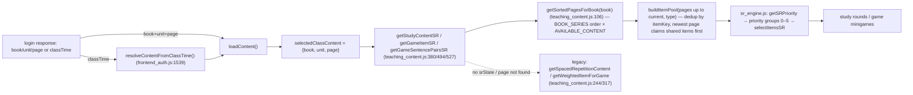

# Frontend Core: Boot, Config, Content & Assets

> **Last verified:** 2026-09-25 · **Part of:** [Classroom-survivors Repo Wiki](README.md)

**Owner files:** `boot.js`, `config.js`, `class_config.js`, `teaching_content.js`, `content_*.js`, `translations.js`, `asset_cache.js`, `bgm.js`, `sr_engine.js`, `gen_missing_audio.js`

The frontend is **vanilla JS with no modules and no build step**. Every file loads via a
`<script>` tag in `index.html` (order documented in [Project Structure](02-project-structure.md))
and communicates through the **global namespace**. This page covers the boot sequence, the
config surface, teaching-content packs and their selection flow, and the asset/audio pipeline.

---

## 1. Global-namespace pattern (how files share state)

- Each file declares `const`/`var`/`function` at top level → all become properties of `window`.
  There is no import/export anywhere.
- Cross-file dependencies are therefore **order-of-declaration**: `config.js` must load before
  `frontend_auth.js` reads `API_BASE_URL` (`frontend_auth.js:2`); `boot.js` must load before any
  game file calls `registerScene()` (`boot.js:44`).
- Some globals are declared in one file and *populated* by another:
  `teaching_content.js:20–34` declares the wizard state (`selectedDay/Time/Student/Book/Unit/ClassContent`),
  `authActiveUser`, and `analyticsQueue` — but `frontend_auth.js` writes them, and `game.js`
  consumes them.
- Deferred/optional dependencies are guarded: `bgm.js:89` checks
  `global.AssetCache && global.AssetCache.getBlobUrl` because `asset_cache.js` loads later; it
  falls back to a plain fetch when absent.
- Historic refactor: `boot.js` was extracted from `vampire_survivors.js`/`game.js` so the shared
  Phaser config lives in exactly one file (`boot_refactor_plan.md`; `grep "const config"` now
  matches only `boot.js`). One wart was left deliberately: games still set `config.parent`
  themselves (`boot_refactor_plan.md` "out of scope").

## 2. Boot sequence

`frontend_auth.js:733` binds `DOMContentLoaded` → `initAuth()` → `registerAppUpdateServiceWorker()`
→ `startVersionWatchdog()`. But the *script-eval* boot is what matters for the game:

```mermaid
flowchart TD
    A["browser loads index.html"] --> B["head: tailwind.js, fonts.css, fontawesome, style.css, phaser.min.js"]
    B --> C["translations.js — LOCAL_TRANSLATIONS object"]
    C --> D["config.js — API_BASE_URL, getAppKey(), TD_ENABLED, THREE_TD_ENABLED"]
    D --> E["sr_engine.js — itemKey, getSRPriority, selection utils"]
    E --> F["frontend_auth.js — APP_VERSION + auth/flush/watchdog functions (DOM ready not yet fired)"]
    F --> G["teaching_content.js — TEACHING_CONTENT={}, AVAILABLE_CONTENT={}, shared globals, persisted-queue helpers"]
    G --> H["content packs — fill TEACHING_CONTENT + AVAILABLE_CONTENT"]
    H --> I["class_config.js — CLASS_CONFIG / CLASS_DAYS"]
    I --> J["boot.js — Phaser config, game, activeGameMode, registerScene, HiDPI helpers"]
    J --> K["bgm.js — window.BGM (lazy AudioContext)"]
    K --> L["vampire_survivors.js / gomoku.js / uno.js — registerScene(MainScene…)"]
    L --> M["speech_* files — Scorer/Recorder/LocalEngine/UI/debug/preload"]
    M --> N["game.js — menus, minigames, dashboard wiring"]
    N --> O["asset_cache.js — window.AssetCache; prefetch timer starts on window load"]
    O --> P["tower_defense.js — uses AssetCache"]
    P --> Q["study_mode.js — STUDY_STATE"]
    Q --> R["DOMContentLoaded → initAuth() + registerAppUpdateServiceWorker() + startVersionWatchdog()"]
    R --> S["initAuth(): testMode? → savedUsers? → profile select → loginWithProfile() → finishLogin()"]
```



### What boot.js does (and does NOT) initialize

`boot.js` (123 lines) has no init function — it only declares globals at load time:

| Export | Where | Role |
|---|---|---|
| `config` | boot.js:10 | Shared Phaser config: `Phaser.AUTO`, arcade physics (gravity 0), `scene: []`, `Scale.RESIZE`, `transparent: true`, `input.activePointers: 3`, `parent: null` (assigned by each game's trigger). |
| `game` | boot.js:36 | The single shared `Phaser.Game` instance, **lazily created by the first trigger\*() call** — boot does not start Phaser. |
| `activeGameMode` | boot.js:39 | `'VampireSurvivors'`, `'Gomoku'`, `'Uno'`, or `null` (trailing source comment lists exactly these; header comment abbreviates them as 'VS'/'Uno'/'Gomoku'). |
| `registerScene(sceneClass)` | boot.js:44 | Games push their scene class at script-load time. |
| `vsDpr()`, `enterHiDpi(el)`, `exitHiDpi()` | boot.js:63–123 | Vampire-Survivors-only HiDPI rendering (`Scale.NONE`, backing = CSS × DPR, zoom = 1/DPR); `exitHiDpi()` restores RESIZE for the other games sharing the canvas. |

## 3. config.js surface

| Export | Behavior |
|---|---|
| `API_BASE_URL` (config.js:6) | `http://localhost:7074/api` on localhost/127.0.0.1, else `https://brave-bush-0438ab000.7.azurestaticapps.net/api`. |
| `getAppKey()` (config.js:20) | One-time promise fetching git-ignored `app-config.json` → `APP_API_KEY`; empty string on failure (dev fallback: API accepts empty key). The key is injected at CI deploy time (workflow step "Inject client app config"). |
| `TD_ENABLED` (config.js:45) | Runtime, merge-safe: `?td=` param → localhost/file:// → true only on the `/Classroom-survivors-preview/` path. Cannot be a per-branch constant, because merging preview→main would carry the wrong value. |
| `THREE_TD_ENABLED` (config.js:61) | Same detection; when false the 3D menu button is *removed from the DOM* (index.html inline script ~887–898), not greyed out. |

## 4. Class config (`class_config.js`)

- `CLASS_DAYS` (class_config.js:2) orders the wizard days: 周一, 周四, 周五, 周六, 周日, 其他老师的学生.
- `CLASS_CONFIG` (class_config.js:77) maps day → time slot (`"1810-1940"`) →
  `{ students: [...first names...], content: { book, unit, page } }`.
- Consumer: `resolveContentFromClassTime()` in `frontend_auth.js:1539` splits a DB `classTime`
  like `"Sat 14:50"`, maps English day abbreviations to the Chinese keys, matches the slot by
  start time (`"1450"` vs slot key prefix), then sets the wizard state and calls `loadContent()`.
  WARNs and bails when nothing matches.

## 5. Teaching-content packs

### What a pack contains

Each `content_*.js` fills two globals:

```js
TEACHING_CONTENT["PU1"] = { "<unit>": { "<page>": {
    vocab: [ "word" | {word, …}, … ],
    sentences: [ "…", … ],
    sentencePairs: [ { a: "Q", b: "A" }, … ]
}}};
AVAILABLE_CONTENT["PU1"] = { "<unit>": [page, page, …] };   // ~1678 in content_pu1.js
```

| Pack | File | Units | Notes |
|---|---|---|---|
| PU1 | `content_pu1.js` (1689 ln) | 0–9 | PetrovisKids(?) level-1 book — see pack header comments |
| PU2 | `content_pu2.js` (1475 ln) | 0–9 | |
| PU3 | `content_pu3.js` (876 ln) | 0–8 | |
| Think0 | `content_think0.js` (535 ln) | 0–2 | |
| Think1 | `content_think1.js` (624 ln) | 0–7 | |
| Think2 | `content_think2.js` (681 ln) | 0–12 | |
| test | `content_test.js` (42 ln) | 1 | fruit QA fixture |

`class_config.js:6–74` carries a comment block mapping every book/unit to page-number lists —
this mirrors `AVAILABLE_CONTENT`.

### Pack selection flow



- `getSpacedRepetitionContent()` (teaching_content.js:244) is the **legacy** study picker:
  ~60% items from the current page ("recent") + ~40% from all earlier pages weighted by
  proximity. Still the fallback when `authActiveUser.srState` is missing
  (`getStudyContentSR`, teaching_content.js:380).
- SR-aware selection lives in `teaching_content.js` (§"SR-AWARE CONTENT SELECTION",
  ~338–544) and delegates the priority math to `sr_engine.js`
  (`getSRPriority()`, sr_engine.js:38): group 0 = failed this session, 1 = failed last
  session, 2 = due/overdue success, 3 = never seen, 4 = cooldown (excluded), 5 = succeeded this
  session. `checkAndAdvancePageIfAllOnCooldown()` (frontend_auth.js:1722) auto-advances the
  assigned page when every item is in group 4.

## 5b. translations.js (structure only)

- 5318 lines, one `const LOCAL_TRANSLATIONS = { … }` object (~5,139 `"english": "中文"` entries,
  verified by grep count), organized only by comment banners (School Supplies, Animals, …,
  ending with full-sentence translations).
- No functions, no keys structure beyond the flat map. Lookup is
  `getLocalTranslation(text)` in `game.js:9–13`: trims the English text and returns
  `LOCAL_TRANSLATIONS[key] || ''` (empty string = untranslated → UI falls back to English).
- Maintained by root tooling: `insert_translations.py`, `reorganize_translations.js`,
  `extract_pu1_v4.js`/`extract_u0_u1.js`.

## 6. Asset cache & audio pipeline

### asset_cache.js (354 lines)

The GFW reality: GitHub Pages assets (sprites ~5 MB, MP3s) are throttled from mainland China
and WeChat evicts the HTTP cache. `asset_cache.js` solves it with the mirror pattern proven by
the 41 MB Whisper download (header comment asset_cache.js:1–29):

1. **Mirror-first fetch** (`sources()`, asset_cache.js:196): on `*.github.io` pages, try
   `https://gh-proxy.com/https://raw.githubusercontent.com/<owner>/<repo>/main/…` first, then
   same-origin. Elsewhere: same-origin only.
2. **IndexedDB permanent cache** (`asset-cache` DB, `files` store; `cacheGet`/`cachePut`,
   asset_cache.js:157–191). Keys are namespaced by group-version tokens
   (`GROUP_VERSIONS`, asset_cache.js:39–47: `sprites/td/`, `sprites/vs/`, `images/vocab/`,
   `audio_mp3/`, `music/`, `sfx/`) — bump ONE token to invalidate just that group.
3. **API** (`window.AssetCache`, asset_cache.js:325): `url()`, `getCached()` (no network),
   `getBlobUrl()` (memory → IndexedDB → mirror; `null` if all fail), `prefetch(paths)`,
   plus path helpers `vocabImagePath()` / `audioPath()` matching game.js conventions
   (asset_cache.js:282–289).
   **Vocab filename rule** (`showVocabImage`, game.js:36): lowercase, spaces → `-`,
   and **apostrophes and commas are kept**.
   > ⚠️ **Corrected 2026-09-25a — the opposite used to be documented here.** Commit
   > `2026-09-16a` added `.replace(/['',]/g,'')` to `showVocabImage` on the stated
   > belief that "apostrophes/commas have no files", and this page repeated that claim
   > while blaming `asset_cache.js` for not following it. Both halves were wrong:
   > - It fixed **nothing** — `slice_vocab_sheet.js` `fileFor()` (the generator that
   >   decides what exists on disk) never strips punctuation, so a stripped name can
   >   never match a generated file. `were.png` does not exist; neither did `we're.png`.
   > - It **broke** the only two punctuation-bearing images that do exist,
   >   `o'clock.png` and `chemist's.png` (added 2026-07-27, six weeks *before* the
   >   strip, and live vocab entries in PU3 and Think1). Students on those pages lost
   >   an illustration that had been working.
   >
   > The strip is now removed, so all three copies agree again. The durable lesson is
   > in [Gotchas](15-gotchas-and-history.md) rule 25; the regression is pinned by the
   > three-way contract block in [Testing](12-testing.md).
   >
   > Across the 280 punctuation-bearing vocab strings the packs do mix apostrophe
   > codepoints (U+0027 and U+2019), so a filename must match the exact codepoint the
   > pack uses — `slice_vocab_sheet.js` passes the word through untouched apart from
   > case and spaces. For `chemist` specifically both PU3 and Think1 use U+0027, which
   > makes the on-disk `chemist’s.png` (U+2019) a dead duplicate of the reachable
   > `chemist's.png` (U+0027). Harmless, but check which codepoint each pack uses before
   > deleting either file.
4. **Manifests**: `TD_SPRITES` (asset_cache.js:58), `VS_SPRITES` (:79), `MUSIC` (:131),
   `SFX` (:138) list every runtime asset; `test_asset_manifest.js` asserts the lists cover every
   sprite on disk, so a new sprite **cannot** ship unprefetched.
5. **Prefetch schedule**: game sprites + music + SFX warm up 2 s after `window load`
   (asset_cache.js:343–349); the current teaching page's vocab images + MP3s prefetch via a
   2 s polling `prefetchCurrentPage()` that derives paths from `TEACHING_CONTENT` +
   `selectedClassContent` at runtime (asset_cache.js:297–323) — no list maintenance.

### bgm.js (165 lines)

- `window.BGM` (`bgm.js:75`): WebAudio gapless loop of `music/study_hall_shuffle.mp3`
  (2 MB). `start()` resolves the MP3 **through AssetCache** (bgm.js:89–91) because GitHub Pages
  alone stalls the file; decodes and computes the true musical end with `findLoopEnd()`
  (bgm.js:36) to skip encoder padding.
- Ducking with stacked reasons, lowest wins (bgm.js:16): `minigame` 25%, `prompt` 25%,
  `speaking` 6%. The auto-duck loop (bgm.js:149–162) polls the DOM every 300 ms for open
  minigame overlays and the `.rec-inline.show` speech indicator — game code never calls duck.
- Mute persists in localStorage `bgmMuted`; `resumeCtx()` is called from game.js gesture
  unlock / visibilitychange / WeixinJSBridgeReady (iOS/WeChat suspend AudioContexts).

### gen_missing_audio.js (166 lines)

Offline coverage tool for the hand-recorded `audio_mp3/` corpus
(`node gen_missing_audio.js content_pu1.js [--generate]`):

1. `vm.runInContext` loads the content pack and collects unique vocab items.
2. Probes Youdao `dictvoice` (the app's primary TTS source) — failure = HTTP 500 for
   `"X - Y"` combos or bodies < 4 KB (calibrated 2026-07-28, header comment).
3. Missing local MP3s (filename = phrase text minus Windows-illegal chars, shared with
   `asset_cache.js audioPath()`) can be generated via the Sound of Text API
   (Google TTS, en-GB), 4 workers, polite batching.

## 7. Historical context (root MDs)

| Doc | Status | Takeaway |
|---|---|---|
| `boot_refactor_plan.md` | Done (Option C) | Moved Phaser `config`/`game`/`activeGameMode`/`registerScene` out of `vampire_survivors.js` + `game.js` into `boot.js`; verified headless via `boot_refactor_test.js`. Left `config.parent` wart untouched. |
| `TEACHING_CONTENT_RESTRUCTURE.md` (Jan 2026) | Done | Introduced the Book > Unit > Page hierarchy + page selector in the start screen; old content archived to `old_teaching_content.js` (no longer present). |
| `TEACHING_CONTENT_CHANGES.md` (Jan 2026) | Done | Randomized power-up minigame assignment; no level-scaling (always all letters/words/5 choices); spelling/grammar reward on eventual success, sight-words first-try-only; minigame time now deducted from survival time. |
| Tailwind/fonts/fontawesome | — | All **self-hosted** (`lib/tailwind.js`, `fonts/fonts.css`, `lib/fontawesome/`) — Google Fonts and CDNs are blocked/slow in CN (index.html comments ~53–58). Fonts: Fredoka, Nunito, Press Start 2P (woff2). |

<!-- VERIFY: PU1/PU2/PU3/Think series publisher mapping ("PetrovisKids(?)") is inferred from names only — confirm against a content pack header if it matters. -->

## Update discipline

Any agent that changes code covered by this page must update this page in the same commit. The wiki is the single source of truth; skills/memory hold only behavior rules and point here.