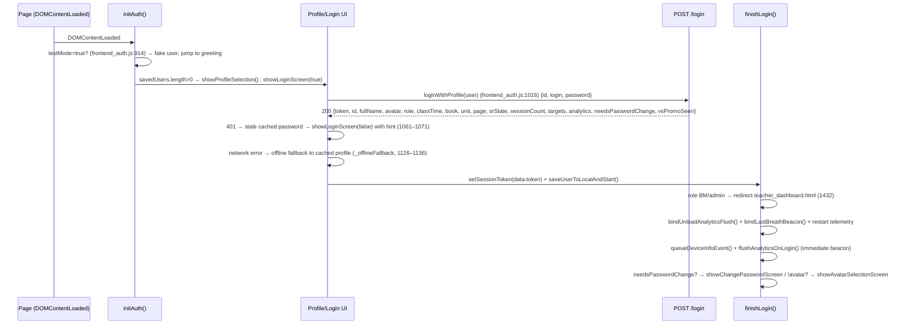
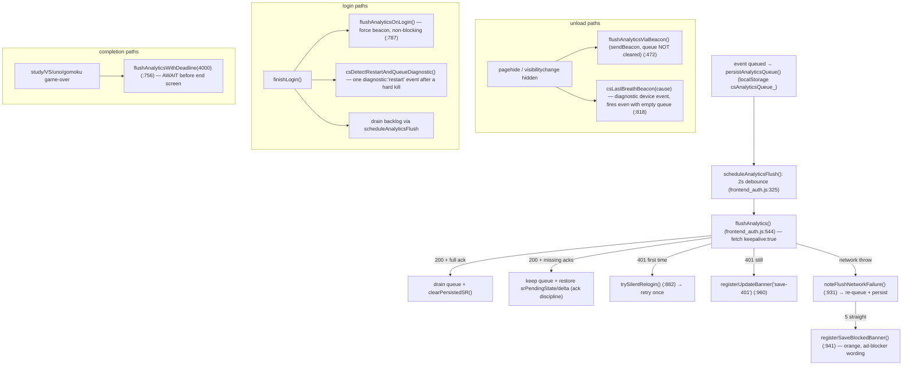

# Authentication, Sessions & Version Watchdog

> **Last verified:** 2026-09-25 · **Part of:** [Classroom-survivors Repo Wiki](README.md)

**Owner files:** `frontend_auth.js`, `api/src/functions/login.js`, `api/src/functions/shared/auth.js`, `version.json`, `sw.js`, `DEPLOY_VERSION_STAMP.md`

`frontend_auth.js` (2089 lines) owns login, the session token, every analytics flush path,
restart telemetry, and the version watchdog. The current deploy stamp is **`2026-09-25a`**
(`version.json:2` = `frontend_auth.js:16` = `index.html:731`).

---

## 1. Login flow

Entry: `DOMContentLoaded` → `initAuth()` (frontend_auth.js:733, 909).

Roles & screens:

| Role | Path |
|---|---|
| `student` | Normal flow; greeting screen (`finishLogin`, frontend_auth.js:1512). |
| `BM` / `admin` | `window.location.href = 'teacher_dashboard.html'` (frontend_auth.js:1432). |
| testMode | `?testMode=true` + name/avatar/book/unit/page params → fake `authActiveUser.id='test-mode'`, no network (frontend_auth.js:914–951). |

Storage keys: `savedUsers` (cached profiles, password **cached in plaintext locally by design** —
it enables silent relogin), `activeUserId`, `csSessionToken`. UI states live in
`profileSelectionOverlay` / `loginOverlay` / `changePasswordOverlay` / `avatarSelectionOverlay`
(index.html ~70–115).

**Per-account key scoping (2026-09-16a).** The queue/SR keys used to be global, so on a shared
device one login inherited and flushed another student's leftovers (reproduced: test accounts were
served a classmate's vocab). Session-scoped state now lives under a `_<studentId>` suffix:

| Base key | Scoped as | Written by |
|---|---|---|
| `csAnalyticsQueue` | `csAnalyticsQueue_<id>` | `persistAnalyticsQueue` (via `persistedQueueKey()`) |
| `csPendingSRState` | `csPendingSRState_<id>` | `persistPendingSR` |
| `csPendingSRIncrement` | `csPendingSRIncrement_<id>` | `persistPendingSR` |
| `csPendingSRSeq` | `csPendingSRSeq_<id>` | `persistPendingSR` |
| `csConfirmedSrSeq` | `csConfirmedSrSeq_<id>` | `persistConfirmedSrSeq` |

`migrateScopedKey(base)` does a **one-time adoption**: if the scoped key is absent but the legacy
global key exists, copy then delete the global — so pre-09-16 installs keep their pending state.
`queueDrain` diagnostics read scoped-then-legacy. Keys that are *not* per-account: `savedUsers`,
`activeUserId`, `csSessionToken` (deliberately device-wide), `csPageHeartbeat`/`csCleanUnload`
(page-lifecycle breadcrumbs). See [Data Model](11-data-model.md) for the full localStorage inventory.

Three helpers make the switch safe, all called from `saveUserToLocalAndStart()`
(frontend_auth.js:1593) **in this order**:
1. `resetInMemorySessionState()` — clears the *previous* login's volatile leftovers first
   (`srPendingState`/`srIncrementSession`/`srPendingSeq`, the debounce timer, and mints a fresh
   `csPageSessionId`).
2. `authActiveUser = user` — only then is the active user assigned, because the scoped-key helpers
   read the id off it.
3. `reloadAnalyticsQueueForActiveUser()` + `loadPersistedSR()` — hydrate *this* account's
   persisted queue and pending SR.

## 2. Session token lifecycle

- **Creation**: server mints an HMAC-SHA256 JWT-shaped token on `/login`
  (`api/src/functions/shared/auth.js:41 signToken()`); payload `{sub, login, role, name, iat, exp}`;
  **TTL = 30 days** (`DEFAULT_TTL = 30*24*3600`, auth.js:21). The server derives the acting
  identity from the token — it never trusts a client-sent student id for scoping
  (frontend_auth.js:18–22 comment).
- **Storage**: `localStorage['csSessionToken']` (`SESSION_TOKEN_KEY`, frontend_auth.js:23;
  `getSessionToken`/`setSessionToken`, :25–30). Cleared on logout via `goBackToProfiles()`
  (`setSessionToken(null)`, frontend_auth.js:1580).
- **Transport**: `apiFetch()` (frontend_auth.js:32) attaches `X-App-Key` (from
  `getAppKey()`) always, and **`X-Auth-Token`** when a token exists (:44). It deliberately does
  NOT use `Authorization`: Azure SWA's managed-functions proxy overwrites that header with its
  own host token, so `X-Auth-Token` is the only header that reaches the function intact
  (frontend_auth.js:40–44; `api/src/functions/shared/auth.js:10–12`).
- **Validation / expiry**: server checks HMAC + `exp` (`shared/auth.js:67`); a 30-day-old token
  returns 401. Client reaction: `flushAnalytics` on 401 → one silent re-login
  (`trySilentRelogin()`, frontend_auth.js:707) using cached `savedUsers` credentials → retry
  flush once; if still 401, `registerUpdateBanner('save-401')` (:504).
- **Renewal**: every fresh login (profile tap, silent relogin, offline-retry) stores the new
  token. There is no client-side refresh timer; the watchdog + banner are the UX recovery.

## 3. Analytics flush pipeline

State: `analyticsQueue` is hydrated from localStorage (`csAnalyticsQueue_<id>`) at script load —
`teaching_content.js` (`loadPersistedAnalyticsQueue` / `persistAnalyticsQueue`). Queueing:
`queueExerciseEvent()` (:164), `queueSessionEvent()` (:211), `queueDeviceInfoEvent()` — each event
carries a stable `eventId` + page-session `ps` stamp + **`ownerId`** (2026-09-16a), then
`persistAnalyticsQueue()` + `scheduleAnalyticsFlush()` (:325, 2s debounce).

`flushAnalytics` (:544) applies, in order, before shipping: drop foreign-`ownerId` events → sort
`type:'session'` events to the front (2026-09-16b) → take at most `MAX_BATCH` = **200** events →
attach the SR payload as a **delta** when one is pending (2026-09-16c). Full details in
[Telemetry & Data Delivery](14-telemetry.md).

| Flush path | Trigger | Transport | Queue cleared? |
|---|---|---|---|
| `scheduleAnalyticsFlush` → `flushAnalytics` (:325, :544) | every queued event | `fetch` `keepalive:true` | only on full ack |
| `flushAnalyticsViaBeacon` (:472) | `pagehide` / `visibilitychange:hidden` | `navigator.sendBeacon` (text/plain Blob), fallback `fetch keepalive`; token+appKey travel in the **body** because SWA drops query params on POST | **never** — server de-dup by `eventId` makes re-send idempotent |
| `flushAnalyticsOnLogin` (:787) | student login, immediately | forced beacon (`{force:true}`) | never (2026-08-28a startup-kill fix) |
| `flushAnalyticsWithDeadline(4000)` (:756) | game-over / session-complete screens (callers **await**) | retried `flushAnalyticsOnGameOver()` (:732, 3 attempts @ `400 * attempt` ms) raced against the deadline | via inner `flushAnalytics` |
| `csLastBreathBeacon` (:818) | pagehide/beforeunload/hidden | one-shot `device` event with `diagnostic:'lastBreath'` + breadcrumb snapshot | n/a (diagnostic only) |

**Ack discipline (2026-09-03a, "Doris silent-200")** — `flushAnalytics` drains the
persisted queue only when the response's `addedEventIds` ∪ `duplicateEventIds` accounts for
**every** shipped `eventId`. A silent or partial 200 keeps the queue and restores
`srPendingState` (plus `srPendingDelta`/`srPendingIsDelta`, so the retry ships the same *delta*
rather than falling back to the oversized full state) so the next login beacon re-ships (server
de-dup keeps it idempotent). The contract is encoded in `test_session_flush_deadline.js` (688
lines): its `fetchStub` echoes the ack contract, and blocks assert full-ack drains / silent-200
keeps the queue / partial-ack keeps the queue / restart diagnostics carry the device signature
(`csPageHeartbeat` → `pageState.dev`, e.g. `iPhone|tp5|wx`).

SR state rides the same flush: `finalizeSession()` (:106) computes the new `srState`, persists it
(`persistPendingSR`, `csPendingSRState_<id>`/`csPendingSRIncrement_<id>`), and the flush body
carries `srState` + `srSeq` + `srDelta:true` + optional `incrementSession` (once-per-day advance,
`hasAdvancedSRSessionToday`). The full state stays in memory/localStorage; only the wire payload is
a delta — see [Telemetry](14-telemetry.md#sr-delta-sync-why-the-completion-packet-is-a-few-kb).

## 4. 2026-08 session-refresh saga (root cause → fix history)

Student referenced in repo docs by a database handle (real name withheld here) — iPad, iOS 26,
WeChat WKWebView + Safari.

> **Round numbers follow `HANDOFF_SESSION_REFRESH_FIX.md`** (R6–R9 exist there); the deploy **stamp**
> is the unambiguous identifier, so use that when cross-referencing. R8/R9 were previously missing
> from this table and are filled in below.

| Round / date | What was proven | Fix shipped (stamp) |
|---|---|---|
| R1 2026-08-25 | Completion record shipped fire-and-forget; WebKit killed the page ~1 s after the completion overlay; session lost everywhere. Server data: only she lost sessions; no reload code exists in student paths. | `flushAnalyticsWithDeadline(4000)` awaited by all 4 completion paths; `saveActiveUserToCache()` never throws (quota → trim analytics mirror to last 500); `test_session_flush_deadline.js` added. (`2026-08-25a`) |
| R2 2026-08-26 | Mum's video: mid-session Safari banner 此网页已重新载入 = WebContent process kill; kills also strike at page start (zero events some days). | **Restart telemetry**: page-session id `ps` on every event, kill-surviving breadcrumb `csPageHeartbeat`, `pagehide` clean-unload marker, one `diagnostic:'restart'` event on next login. (`2026-08-26b`) |
| R3 2026-08-27 | Telemetry showed the two "restart" diagnostics were self-read artifacts — detection ran after the new page session was minted. | `finishLogin` order fixed: detection **before** `csNewPageSession()`/`csPageHeartbeat()` + same-`ps` guard. (`2026-08-26c`) |
| R4 2026-08-28 | Startup kills inside the first 2 s left a total blackout (not even the login device event). | `flushAnalyticsOnLogin()` immediate forced beacon on login. (`2026-08-28a`) |
| R5 2026-08-29 | Real data-loss root cause #1: her Cosmos doc had grown to 5,573 events / 1.37 MB → ~26 s upserts → 4 s deadline + SWA timeouts silently dropped saves; #2 memory spike → WebKit crash. | Manual archive+trim; **server auto-archive** in `saveAnalytics.js` (≥700 events → archive, keep 90 days of sessions + 500 recent); `test_auto_archive_analytics.js`. (`e275195`) |
| R6/R7 2026-09-03 | The refreshes were never the data-loss vector: her fetch flushes got ok-looking 200s while **nothing persisted** ("silent-200") for 6 days; queue was being drained on lies. | Server `saveAnalytics` returns per-event acks + `delivery_diag_saveAnalytics` telemetry doc; client ack discipline (§3); tests updated. (`2026-09-03a`) |
| R8 2026-09-04 | Even *acked* events could vanish: two concurrent flushes read the same doc and last-writer-wins erased the other's writes (measured 33% loss under a 15×2 concurrent-POST probe). | IfMatch/`_etag` optimistic concurrency with ≤4 retry-merge rounds; PK-safe point-writes for the 93 legacy null-PK docs; `test_speech_hygiene.js` (AudioContext leaks were the *other* kill vector). |
| R9 2026-09-08 | Long-term student hit an all-cooldown pool → session dead-ended to the menu; the page-advance decision evaporated; CHECK rejected correct placements. | Cooldown floor (least-overdue, never null) + sticky `csPendingPageAdvance` + `normMatchText` + `queueDrain` login report. (`2026-09-08a`) |
| R10 2026-09-10 | A stuck "saving" flag and obsolete SR updates kept re-riding flushes forever. | SR newer-wins gate (`srSeq` / `confirmedSrSeq`; client drops anything ≤ server-confirmed) + stuck-flag fix. (`2026-09-10a`) |
| R11 2026-09-16a | Her PC **froze the page**; separately a classmate's test accounts saw **her** vocab. | Content blocker → `ERR_BLOCKED_BY_CLIENT` on every API call → unbounded queue → `JSON.stringify` threw `Invalid string length` synchronously, escaping the catch. Plus global localStorage keys let one login inherit another's queue. → 500-event backpressure cap, 200-event chunks, stringify guard; per-account scoped keys + `ownerId` tags + in-memory reset on login (§3); save-blocked orange banner (§5); API bypass in speech `patchedFetch` ([Speech](08-speech.md)); self-service `updateStudent` placement ([Backend](10-backend-api.md)). (`2026-09-16a`) |
| R12 2026-09-16b | ~60 exercises delivered, **0 sessions** confirmed; the end screen hung "slightly longer". | Session records queued last but re-queued to the front on every failure → session-first ordering before batching; completion retry backoff 800→400 ms (the screen awaits it, so the waits *were* the hang). (`2026-09-16b`) |
| R13 2026-09-16c | One long-enrolled account failed **every** flush with `Failed to fetch`, no server contact at all. | 65KB full-state SR packet > Chromium's ~64KB keepalive cap, and it rode along on small in-session flushes too → SR **delta sync** (`extractSRDelta` + `srDelta` flag + server merge). (`2026-09-16c`) |

Sources: `SESSION_REFRESH_ROOTCAUSE_2026-08-25.md`, `HANDOFF_SESSION_REFRESH_FIX.md` (§R6
supersedes earlier rounds; **R11–R13 have no root handoff doc yet — this table is their only
write-up**), `HANDOFF_SESSION_FIX_FULL.md` (July beacon-401/WeChat fixes; its
"deployment gap" section is obsolete). Standing verdict: the app has **zero automatic reload
paths** (`sw.js` passive; watchdog banner is user-tap-only; only `showReloginOverlay`'s force
button reloads) — the forced refreshes are external WebKit kills.

## 5. Version watchdog (the self-heal that reaches WeChat)

WeChat's iOS in-app WebView is a WKWebView: **no `navigator.serviceWorker`** (so `sw.js` never
installs there) and aggressive caching that ignores `Cache-Control`. The watchdog is the
SW-independent rescue:

- `startVersionWatchdog()` (frontend_auth.js:1103): first `tick` at 5 s after load, then every
  **60 s**; fetches `version.json?v=Date.now()` with `cache:'no-store'`.
- `_parseVersion()` / `_versionGreater()`: stamps compare as
  year → month → day → letter (`a`=1). If live `version` **>** running `APP_VERSION` (and not
  suppressed), → `registerUpdateBanner('version-watchdog')`.
- `registerUpdateBanner(reason)` (:960): fixed red bottom banner
  `⚠️ 无法保存进度 — 点击重新输入密码`, shown to **all** users (students + teacher), once per
  page load. Tap → `showReloginOverlay()`: re-enter password (updates cached password,
  retries `flushAnalytics()`, suppresses the watchdog via `_versionWatchdogSuppressed`) or
  "强制刷新页面" (unregister SWs, delete caches, `location.replace(?_cb=…)`).
- Banner also fires from `registerUpdateBanner('save-401')` on unfixable 401 flushes —
  same banner, different reason.

### Save-blocked banner (orange) — a different failure, different advice

`registerSaveBlockedBanner()` (:941) exists because a **red "re-enter your password"** banner is
the wrong instruction when nothing is wrong with the login. Detection is `noteFlushNetworkFailure()`
(:931) / `noteFlushNetworkSuccess()`: a flush whose `fetch` **threw** (blocked / offline / timeout)
while the page itself loaded fine points at a content blocker or captive portal eating the API host —
not a server problem. After `NET_FAIL_BANNER_AFTER = 5` consecutive network throws it shows an orange
(`#92400e`) `role="alert"` banner reading
`⚠️ 保存被浏览器拦截 — 请检查广告拦截器 (uBlock/AdGuard) 是否阻止了本页面，然后点击重试`.
It reuses the `appUpdateBanner` element id (so only one banner shows at a time), and tapping it
resets the streak and retries `flushAnalytics()`. Any successful flush zeroes the streak.

| Banner | Color | Trigger | Intended user action |
|---|---|---|---|
| `registerUpdateBanner` | red | version drift / watchdog, or unfixable 401 | re-enter password, or force-refresh |
| `registerSaveBlockedBanner` | orange | 5 consecutive **network-throw** flushes | disable/allowlist uBlock–AdGuard, then retry |

**THREE-STAMP RULE** — all three must be byte-identical after every deploy:

| # | Location | Current value (2026-09-25) |
|---|---|---|
| 1 | `version.json` `"version"` | `2026-09-25a` |
| 2 | `frontend_auth.js:16` `const APP_VERSION` | `'2026-09-25a'` |
| 3 | `index.html:731` `frontend_auth.js?v=` | `?v=2026-09-25a` |

Enforced by `test_deploy_stamp_sync.js` (73 lines, **first** in the `npm test` chain): parses all
three, fails the run on drift, and is the reason a stamp drift cannot be committed through the
normal test gate. Full write-up: `DEPLOY_VERSION_STAMP.md`. A mismatch = permanent red banner
for everyone (live version stays "greater" than the running stamp) or stale builds that never
self-heal. Verified 2026-09-25: all three = `2026-09-25a` (bumped for the vocab-filename
regression fix; see [Frontend Core](03-frontend-core.md)).

**Sub-resource `?v=` counters are separate.** Non-`frontend_auth.js` scripts carry their own
integer cache-buster, bumped by hand when that file changes. `speech_engine.js?v=11`
(index.html:750) was specifically bumped in `2026-09-16c` because the API-bypass patch had been
*edited but never re-fetched* by browsers — a fix can sit undelivered behind a stale cache until
its counter moves. See [Speech](08-speech.md).

## 6. API endpoints called by frontend_auth.js

| Endpoint | Method | Where | Purpose |
|---|---|---|---|
| `/login` | POST | :713 (silent relogin), :799 (banner relogin), :1056 (profile refresh), :1169 (offline retry), :1262 (manual login) | Auth + fresh profile/token. |
| `/saveAnalytics` | POST | :479 (fetch flush), :422/:678 (beacon/last-breath URLs) | Event ingest + `srState`; returns per-event acks. |
| `/changePassword` | POST | :1331 | `handleChangePasswordSubmit()` when `needsPasswordChange` (admin reset). |
| `/updateAvatar` | POST | :1360 | `selectAvatar(emoji)` on first login / avatar change. |
| `/updateStudent` | POST | page auto-advance (`checkAndAdvancePageIfAllOnCooldown`) | **Self-service since 2026-09-16a**: a student token may update `book`/`unit`/`page` for its own `studentId` only. Previously every auto-advance 403'd, so a 43→48 page move could never stick server-side. Any other field still needs teacher/BM/admin. See [Backend API](10-backend-api.md). |

Auth attachment summary: header `X-App-Key` = deploy-injected client key (value lives in
CI secret `APP_CLIENT_KEY` → `app-config.json`; never in the repo); header `X-Auth-Token` =
session token; beacon/last-breath variants carry both in the JSON body instead (headers are
impossible on `sendBeacon`, and SWA drops POST query params).

## 7. Password change & avatar flows

- **Forced change**: login response `needsPasswordChange=true` → `showChangePasswordScreen()`
  (:1312) → `handleChangePasswordSubmit()` (:1320) POSTs `{id, newPassword}` →
  `showAvatarSelectionScreen()`.
- **Avatar**: `selectAvatar(emoji)` (:1356) POSTs `{id, avatar}` → sets `authActiveUser.avatar`
  → `saveUserToLocalAndStart()`. On profile-login flow, `!data.avatar` also routes to avatar
  selection (`handleLoginSubmit`, :1300).
- **Banner relogin** (`showReloginOverlay`, :768): password-only form; on success updates
  `savedUsers` cached password, hides banner, `_versionWatchdogSuppressed = true`, retries flush.

## 8. Misc behaviors worth knowing

- `saveActiveUserToCache()` (:1402): rewrites the whole `savedUsers` cache after **every queued
  event**; quota-exceeded → retry once with analytics trimmed to the most recent 500 events.
- Target meter logic shared with dashboards: `selectStudentTarget()` (:1597, active → most
  recent past → nearest upcoming), `countCompletedSessionsForTarget()` (:1670) and
  `isUncountedShortLoss()` (:1694) — game-mode losses < 120 s of *survival* time don't count
  toward targets (anti-cheat; `TWO_MIN_RULE_START` = 2026-07-27, `TARGET_MIN_LOSS_SEC = 120`).
- Service worker: `registerAppUpdateServiceWorker()` (:851) registers `sw.js?v=APP_VERSION`
  (https/localhost only — WKWebView has no SW, which is why the watchdog exists).

## Update discipline

Any agent that changes code covered by this page must update this page in the same commit. The wiki is the single source of truth; skills/memory hold only behavior rules and point here.