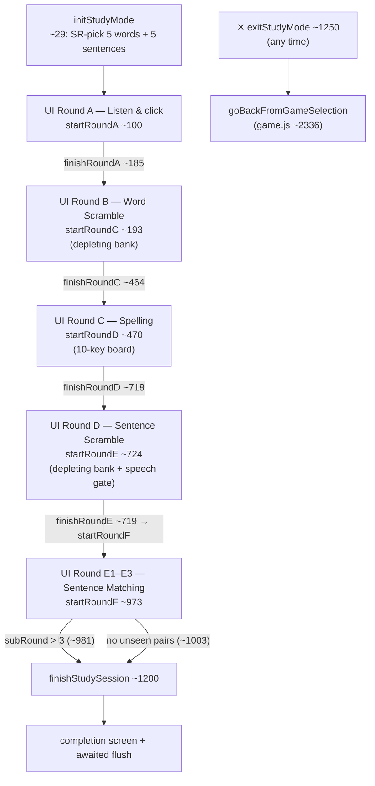
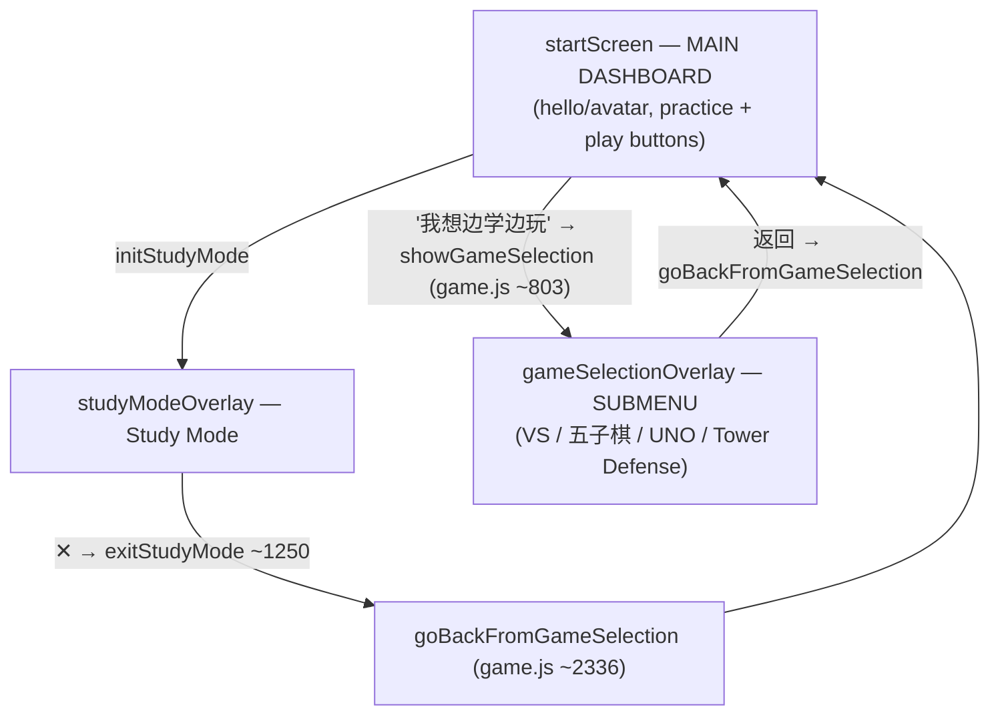

# Study Mode (UI Rounds A–D + Match; internal functions A/C/D/E/F)

> **Last verified:** 2026-09-04 · **Part of:** [Classroom-survivors Repo Wiki](README.md)

**Owner files:** `study_mode.js` (1360 lines — the whole subsystem), `index.html` (`#studyModeOverlay`, `#study-game-area`, exit X ~line 327), `style.css` (`.study-*` classes), `sr_engine.js` (content/pair selection helpers called from here), `game.js` (`playTTS`, `goBackFromGameSelection`, the global keydown guard).

Study Mode is the structured practice flow: 5 SR-selected words and 5 SR-selected sentences, drilled through five rounds of increasing production difficulty, plus three sub-rounds of sentence matching. Everything lives in one global `STUDY_STATE` and a set of top-level functions; there is no class.

## 🔴 The naming is off by one — trust code, not names

The **function names are shifted by one round relative to the UI labels**. `startRoundC` implements UI "Round B", `startRoundD` implements UI "Round C", and so on. The internal round keys also skip `'B'` (`STUDY_ROUNDS = ['A','C','D','E','F']`, `study_mode.js ~1265`). All freeze flags and timers follow the *internal* key (`_roundCFrozen` guards UI Round B).

| UI label (what the student sees) | Internal round key | Entry function | What it actually does |
|---|---|---|---|
| "Round A: Word Recognition" | `'A'` | `startRoundA (study_mode.js ~100)` | Listen to TTS, click the matching word |
| "Round B: Word Scramble" | `'C'` | `startRoundC (study_mode.js ~193)` | Letter bank → slots (depleting bank) |
| "Round C: Spelling" | `'D'` | `startRoundD (study_mode.js ~470)` | Type from a 10-key random keyboard |
| "Round D: Sentence Scramble" | `'E'` | `startRoundE (study_mode.js ~724)` | Word tiles → sentence slots (depleting bank) |
| "Round E1–E3: Sentence Matching" | `'F'` | `startRoundF (study_mode.js ~973)` | Match question tiles to answer slots, 3 sub-rounds |

Progress-bar labels (`STUDY_ROUND_LABELS`, ~1266) are `A:'Listen', C:'Scramble', D:'Spell', E:'Sentence', F:'Match'` — also keyed by the internal names.

## Lifecycle

`initStudyMode (~29)`: reads `selectedClassContent` (book/unit/page), pulls content via `getStudyContentSR(book, unit, page, 'vocab'|'sentences', 5)` (sr_engine.js). Fewer than 5 of a kind shows a non-blocking notice (`showStudyNotice ~20`, replaces `alert()`) and runs a shorter session; zero of either aborts. It then sets `active=true`, resets SR tracking (`srStudyResults=[]`, `srUsedPairKeys=new Set()`), hides the start screen and every other overlay, **stops the Phaser scenes** (`MainScene`, `UnoScene`), hides the canvas, clears `minigameCountdownInterval`, hides the VS HUD buttons, sets `activeGameMode = null`, and shows `#studyModeOverlay`.

## STUDY_STATE shape

Declared at `study_mode.js ~2`; behavior fields are added dynamically by the rounds:

| Field | Meaning |
|---|---|
| `active` | Study Mode running. **Must be reset to `false` on exit** (see [exit pitfall](#exit-path--the-study_stateactive-trap)) |
| `words`, `sentences` | The 5 SR-picked words / sentences for this session |
| `remainingWordsRoundA` | Round A: words not yet recognized |
| `currentWordIndex` | Shared cursor for UI Rounds B and C |
| `currentSentenceIndex` | Cursor for UI Round D |
| `round` | Internal key `'A'…'F'` (drives the keydown router, ~1311) |
| `startTime`, `timerInterval` | Session timing |
| `isTransitioning` | Blocks ALL input during the 1–1.5s success advance (and the Round F 2s reset) |
| `srFinalized` | Set in `finishStudySession`/exit so results aren't double-finalized |
| `_roundCFrozen` / `_roundDFrozen` / `_roundEFrozen` | Per-round freeze during wrong-answer reveal (UI Rounds B / C / D) |
| `_roundDFeedback`, `_roundDSuccess` | UI Round C reveal coloring flags (read by `updateRoundDDisplay ~613`) |
| `_roundDResetTimer`, `_roundEResetTimer` | Single 5s reveal-reset timers (UI Rounds C and D) |
| `subRound`, `sentencePairs`, `pairAttempts[]`, `pairQueued[]` | UI Round E matching state |

Module-level globals: `srStudyResults` (per-item `{type, key, firstAttempt}` records, ~16) and `srUsedPairKeys` (pairs already shown in UI Round E this session, ~17).

## Round reference

### UI Round A — Word Recognition (`'A'`)
`renderRoundAWords (~122)` renders the 5 words as buttons (shuffled, removed on success — no re-layout). `playRoundAPrompt (~147)` picks a random *remaining* word, sets the global `currentTTSWord`, and plays TTS after 500ms (translation hint + vocab image via `showTranslation`/`showVocabImage`, game.js). `checkRoundA (~160)`: correct → scale-out animation, remove from list, next prompt; wrong → `synthError()`, red shake, replay TTS after 600ms. Guards on `isTransitioning`.

### UI Round B — Word Scramble (`'C'`) — **depleting bank**
Containers: `#scramble-slots` (answer) + `#scramble-bank` (source), built by `nextRoundCWord (~201)`.

- **Slots**: one `.study-slot` per character. Letter slots are wrapped in `.word-group` divs; separators (` `, `-`, `.`, `?`, `!`) are direct flex items with `dataset.fixed="true"` (space is invisible; the other four render their glyph).
- **Bank**: the word's letters minus separators, shuffled, as `.study-letter-btn` buttons. **The bank DEPLETES**: `addLetterToSlot (~304)` places into the earliest empty non-fixed slot and **removes the clicked button** (~321). Clicking a placed letter (`removeLetterFromSlot ~324`) clears the slot and appends a **fresh** bank button — the gap stays (no reflow).
- `roundCSlots (~300)` is the ONLY way to enumerate slots: `querySelectorAll('#scramble-slots .study-slot')`. `#scramble-slots.children` are the `.word-group` wrappers — indexing them silently corrupts state (see [.word-group convention](#the-word-group-dom-convention)).
- `checkRoundC (~354)`: incomplete → soft `synthError()` nudge, no reset. Grades every non-fixed slot against `targetWord[i]` (full-string index; fixed slots occupy their own positions). Correct → freeze + `isTransitioning`, SR success push, `queueExerciseEvent('wordScramble','study',word)`, advance after 1s. Wrong → freeze, SR failure recorded **at the first wrong check** (`exerciseAttempts === 1`), `incrementExerciseAttempts()`, and a 5s reset that returns EVERY letter to the bank before unfreezing. Quirk: this widget stores the reset timer **per slot** (`slot._resetTimer`), not on `STUDY_STATE`.
- `clearRoundC (~438)`: blocked only during the 1s success transition. Clears every slot's `_resetTimer`, returns letters to the bank, unfreezes — **CLEAR must stay live during the reveal**.

### UI Round C — Spelling (`'D'`) — 10-key board
`nextRoundDWord (~478)`: keyboard = the word's own letters (excluding `[' ',"'",'-','.','?','!',',']`) shuffled-plus-sorted, padded with random letters to exactly **10 keys** (`keys.sort()`). Each `.study-key` carries `dataset.keyIndex`.

- State model (the bug-class fix): `roundDPlacement[slotIdx] = keyIndex` + `roundDUsedKeys[keyIndex]` — **per-slot placement decoupled from typing order** (~553). `roundDRebuild (~559)` reconstructs `roundDInput` left-to-right from placement. Two identical letters each own their own tile.
- `typeRoundD (~563)` fills the earliest empty *letter-slot* (slot order, not typing order); a used tile is refused by its own placement, not by typing position. `deleteRoundDLast (~578)` removes the rightmost placed slot; `removeRoundDLetter (~589)` frees that slot's tile.
- `updateRoundDDisplay (~613)` re-renders `#spelling-display` with `.word-group` grouping and per-slot green/red during feedback; filled slots are click-to-delete unless frozen. **The keyboard is a STATIC palette**: used tiles get a `.used` class, never removed.
- `checkRoundD (~669)`: compares `roundDInput` to the word's letters only. Correct → success freeze, `queueExerciseEvent('spelling','study',word)`, 1s advance. Wrong → freeze + feedback, `incrementExerciseAttempts()`, `STUDY_STATE._roundDResetTimer` 5s reset (placement/usedKeys cleared, colors cleared, unfreeze). **Note:** the wrong branch of `checkRoundD` does *not* push an `srStudyResults` failure record (unlike UI Rounds B, D, E) — spelling SR failures are only captured in game mode; verified from code ~700–715.
- `clearRoundD (~600)`: cancels `_roundDResetTimer`, clears feedback/frozen, empties placement. Blocked only during `isTransitioning`.

### UI Round D — Sentence Scramble (`'E'`) — **depleting bank + speech gate**
`nextRoundESentence (~732)`: one `.sentence-slot` per token in `#sentence-drop-zone` (`dataset.expected`), shuffled `.study-word-tile` buttons in `#sentence-word-bank`. Array-wrapped sentence entries are unwrapped (`sentence[0]`).

- **Delegated listeners only** (~784, ~790): `bank.onclick` → `placeWordTile` for `e.target.closest('.study-word-tile')`; `dropZone.onclick` → `deleteWordTile` for `.study-word-tile.placed`. **Never add per-tile `onclick`** — the same click then fires twice (double-place / double-return).
- `placeWordTile (~812)` moves a **copy** into the earliest empty slot and removes the bank tile (depletes). `deleteWordTile (~829)` re-creates a bank button.
- `checkRoundE (~866)`: per-slot compare vs `dataset.expected`; tiles get `!bg-green-500`/`!bg-red-500`. Correct → SR success (`type:'sentences'`), `queueExerciseEvent('sentenceScramble','study',…)`, then the **speech gate**: if `window.SpeechStatus.isReady() && window.SpeechUI.makeSentenceGate`, the CHECK/CLEAR row is hidden and the gate is rendered *into the bank's space*; `onDone` advances. If speech isn't ready the skip reason is logged via `window.__speechLog` (~930 — "without this the skip is invisible in the field") and a 1s timer advances. The gate never affects SR state.
- Wrong → `_roundEFrozen = true` (not `isTransitioning`, so **CLEAR still works**), border flashes red, SR failure at first wrong check, `_roundEResetTimer` 5s: all tiles returned to the bank, unfreeze. `clearRoundE (~841)` does the same immediately and cancels the timer.

### UI Round E1–E3 — Sentence Matching (`'F'`) — **not depleting**
`nextRoundFSubRound (~980)`: 3 sub-rounds; pairs come from `getStudySentencePairsSubRoundSR(book, unit, page, srUsedPairKeys, preferPrevious = subRound > 1)` (sr_engine.js) — due pairs always win; E1 favors the current page, E2/E3 review earlier pages. If no unseen pairs exist anywhere up to the current page, Round F ends cleanly. Shown pairs are recorded in `srUsedPairKeys` so later sub-rounds pull fresh ones.

- `renderRoundF (~1017)`: question rows (`.sentence-a` + `.sentence-b-slot`), shuffled answer dock `#sentence-b-dock`. Tiles MOVE between dock and slots (same DOM node) — the dock never depletes.
- `selectBTile (~1061)` selects (yellow ring); `handleSlotClick (~1071)` places into a slot or returns a placed tile via `returnTileToDock (~1092)`.
- `checkRoundF (~1099)`: text-match per slot; each pair's SR result is queued once (`pairQueued`) with `firstAttempt = pairAttempts === 1`; failures recorded at the first wrong check per pair. All correct → 1.5s advance to the next sub-round; else 2s `resetRoundF (~1183)`.

## CHECK → reveal → reset (shared anti-cheese pattern)

Every drill round uses the same loop: **CHECK** → grade → color green/red → (wrong) **freeze editing for ~5s** → auto-reset to a clean board → (or CLEAR to skip the wait). Rules that were all ship-breaking bugs once:

1. Editing handlers (`addLetterToSlot`, `typeRoundD`, `placeWordTile`, …) early-return while frozen/transitioning.
2. **CLEAR stays live during the wrong-answer reveal** (only the 1s success transition blocks it). It cancels the pending reset, restores the source, and unfreezes.
3. The 5s reset must **restore depleting sources** (fresh bank buttons appended), never a bare `.remove()` — the 2026-07 "words vanish after 5 seconds" regression.

## Static palette vs depleting source

| Widget | Source | Behavior |
|---|---|---|
| UI Round B bank (`#scramble-bank`) | **DEPLETES** | Click bank letter → moves into earliest empty slot, bank tile removed; click placed letter → fresh tile back in bank |
| UI Round C keyboard (`#virtual-keyboard`) | STATIC palette | Used tiles get `.used`, stay visible; placed letters delete into nothing |
| UI Round D bank (`#sentence-word-bank`) | **DEPLETES** | Tile moves to slot; placed tile returns as a fresh button |
| UI Round E dock (`#sentence-b-dock`) | STATIC (moves) | Same tile node shuttles dock ↔ slot |

Because three sources deplete, any reset/CLEAR path must rebuild the source from the placed tiles. Never "fix" a depleting source back to static (user-locked UX).

## Fixed-character (pinned) slots

In UI Round B, characters in `[' ', '-', '.', '?', '!']` render as **pinned** slots (`dataset.fixed="true"`, `nextRoundCWord ~237–257`): pre-filled, not clickable, never moved into the bank by reset/CLEAR, skipped by grading.

**Deliberately NOT pinned (draggable tiles the student must place):** apostrophe `'`, comma `,`, curly apostrophe `'`. This is a user decision — students must manually place apostrophes in contractions (`doesn't`, `I'm`); comma stays a tile in `yes, it is`. UI Round B and the game-mode word scramble must behave identically for separators (game.js mirrors this with its own `punct` array — change BOTH together, see [Game Modes](06-game-modes.md)).

**Policy: when the user points at a word whose separator is outside the pinned set, tell them — don't auto-extend the list.**

## The `.word-group` DOM convention

Letter slots in the answer rows are wrapped in `.word-group` divs so a word (e.g. `danced`) never breaks across lines; separators sit between groups so wrapping only happens at word boundaries. Consequence: **never index slots via `container.children[i]`** — the direct children are groups. Always use a `.study-slot` descendant query (`roundCSlots()` in production). UI Round C's display is rendered as HTML strings with `` (`updateRoundDDisplay ~613`). `fitAnswerArea` (game.js ~1371) shrinks `--answer-font`/`--slot-size` when a long word would overflow narrow phones.

## Keyboard support

`study_mode.js` registers one global `keydown` listener (~1311): `if (!STUDY_STATE.active) return;` then routes by `STUDY_STATE.round`:

- Internal `'C'` (UI Round B) → `handleRoundCKeyDown (~1321)`: Backspace removes the last filled letter-slot; letter keys click the first matching bank button; Enter = CHECK.
- Internal `'D'` (UI Round C) → `handleRoundDKeyDown (~1344)`: Enter = CHECK, Backspace = `deleteRoundDLast`, letter keys type the first matching *unused* keyboard tile.

## SR recording rules

- Success: `{type:'vocab'|'sentences'|'sentencePairs', key: itemKey(item), firstAttempt: exerciseAttempts === 1}` pushed at the successful check; `queueExerciseEvent(...)` fires the analytics event.
- Failure: pushed **at the first wrong check** per item (UI Rounds B, D, E), so quitting after a mistake still marks the item due next session. `finalizeSession` collapses first-failure + later-success.
- Partial sessions: `exitStudyMode` finalizes non-committed results with `finalizeSession(srStudyResults, false)` (~1254); completed sessions are finalized in `finishStudySession`.

## Session end, exit, and the two big pitfalls

`finishStudySession (~1200)`: sets `srFinalized`, calls `finalizeSession(srStudyResults)`, queues the `study` session event, then **awaits `flushAnalyticsWithDeadline(4000)`** before showing the completion screen — the 2026-08-25 "Doris refresh" fix (iOS WebKit can restart the page within ~1s; a fire-and-forget flush lost the session).

### Cooldown floor — a null pool must never dead-end a session (2026-09-08)

Success doubles SR intervals, so a long-term successful student eventually has EVERYTHING on cooldown (proven on live data: 148/148 pairs, E1 returned null → session fell back to menu). The floor, in `sr_engine.js` + `teaching_content.js`:

- `sortPoolBySR` drops group-4 from pick order but keeps it on `sorted._cooldown`.
- `pickWithNewQuota` serves least-overdue cooldown items when pickable runs short.
- The study pair selector reports group 4 (not 6-"empty") for all-cooldown pages and tops up to 3 pairs — a null now means TRULY no pairs exist.
- Rule: practice beats a dead session. Pinned by Rule5 in `test_round_e_dedup.js`.

### Sticky page-advance (2026-09-08)

`checkAndAdvancePageIfAllOnCooldown` (frontend_auth.js ~1722) moves a fully-cooled student up one page — but the decision used to evaporate when `updateStudent` failed, then re-decide "stay" at an incremented sessionCount. The pending page now persists in `csPendingPageAdvance`, re-applies at login BEFORE the normal check (`reapplyPendingPageAdvance`), and clears only on server confirm.

### CHECK comparison: `normMatchText` (2026-09-08)

Tile text is interpolated into HTML with surrounding whitespace, so strict equality could fail a visually-correct placement forever. Both `checkRoundF` (study) and `checkSentenceMatch` (game) compare via `normMatchText()` (`sr_engine.js`: collapse whitespace runs incl. NBSP → trim → lowercase). Display-text only — `itemKey` stays the storage key. Pinned by Rule6.

### Exit path & the `STUDY_STATE.active` trap

`exitStudyMode (~1250)` must do exactly three things, all load-bearing:

1. Finalize any observed-but-unfinalized results (partial credit).
2. **`STUDY_STATE.active = false`** — the game-mode global keydown listener (`game.js ~2253`) early-returns while this flag is true. If it is left `true`, physical-keyboard typing dies in the game-mode spelling minigame after any study session (shipped bug).
3. Hide `#studyModeOverlay` and call **`goBackFromGameSelection()`** (`game.js ~2336`) — the same function the 返回 (Back) button uses — which reveals `#startScreen` (the **main dashboard**) and hides `#gameSelectionOverlay`.

Wrong directions that shipped: routing the X through an undefined `triggerStartGame()` (froze the game on the VS HUD) and returning to `gameSelectionOverlay` (a submenu, not the main menu).

`startScreen` is the main dashboard; `gameSelectionOverlay` is a submenu; `studyModeOverlay` is the study surface. The exit X is wired at `index.html ~327`.

## Which tests cover this

- `test_widgets_regression.js` — jsdom harness loading the REAL scripts in index.html order; asserts the depleting bank, delete-preserves-gap, and freeze behaviors across the scramble/spelling widgets (includes Round B + game-mode parity).
- `test_round_e_dedup.js` — VM test of the UI-Round-E sub-round pair-selection rules (due-first, page preference, no repeats) by loading `sr_engine.js` + `teaching_content.js`.

Both are in the `npm test` chain — see [Testing](12-testing.md). Related live behavior (speech gate) is covered in [Speech Recognition](08-speech.md); historic bug lore in [Gotchas & History](15-gotchas-and-history.md).

## Update discipline

Any agent that changes code covered by this page must update this page in the same commit. The wiki is the single source of truth; skills/memory hold only behavior rules and point here.
