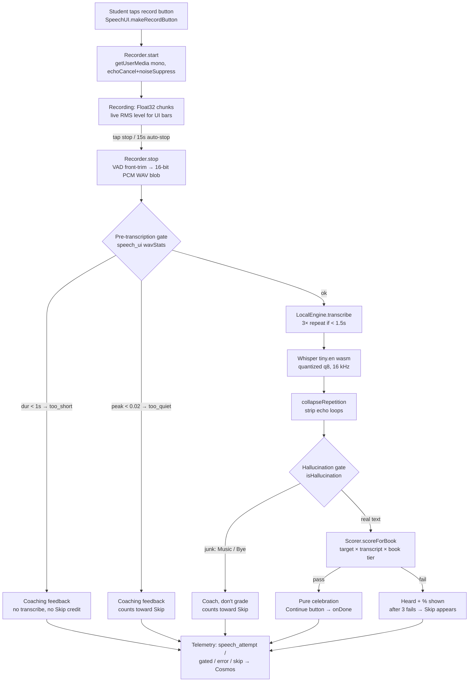

# Speech Recognition & Pronunciation Scoring

> **Last verified:** 2026-09-25 · **Part of:** [Classroom-survivors Repo Wiki](README.md)

**Owner files:** `speech_engine.js`, `speech_recorder.js`, `speech_scorer.js`, `speech_ui.js`, `speech_debug.js`, `speech_preload.js`, `sr_engine.js`, `test_sr_once_per_session.js`, `models/whisper-tiny.en/`, `api/tune_scorer.js`, `api/analyze_speech.js`, `gen_missing_audio.js`

The app does **fully in-browser speech recognition** (no server round-trip, no API key, audio never leaves the device) with a pure-JS pronunciation scorer on top. There is **no Web Speech API and no Azure Speech SDK** in the speech path — the only engine is Whisper running locally via Transformers.js (verified: `grep` for `webkitSpeechRecognition|AzureSpeech` matches nothing outside the bundled `lib/transformers.min.js`; `index.html:747` labels the stack "self-contained, global: LocalEngine / Recorder / Scorer").

## 1. Component map

| File | Global | Role |
|------|--------|------|
| `speech_engine.js` (557 ln) | `window.LocalEngine` | Loads Whisper tiny.en (Transformers.js v3, WASM backend), transcribes WAV/Float32 → text |
| `speech_recorder.js` (161 ln) | `window.Recorder` | Mic capture via getUserMedia + ScriptProcessor → 16-bit mono WAV (VAD-trimmed) |
| `speech_scorer.js` (191 ln) | `window.Scorer` | Pass/fail decision: char-accuracy OR WER OR phonetic coverage, per level + per book |
| `speech_ui.js` (566 ln) | `window.SpeechUI` | Record button, sentence gates, junk-audio/hallucination gates, permission recovery, telemetry |
| `speech_preload.js` (78 ln) | `window.SpeechStatus` | Eager model preload before login; state machine for UI |
| `speech_debug.js` (153 ln) | `window.__speechLog` + debug panel | On-screen load diagnostics + rolling log + Retry |
| `sr_engine.js` (329 ln) | pure functions | ⚠️ **Not speech** — "SR" = *Spaced Repetition*. Item selection + SR interval math (see §7) |
| `test_sr_once_per_session.js` (172 ln) | test | SR once-per-session invariant tests (see §7) |

Script order in `index.html:747-758`: `speech_scorer` → `speech_recorder` → `speech_engine` → `speech_ui` → `speech_debug` → `speech_preload` (debug must load **before** preload so the log hook exists).

## 2. End-to-end pipeline



## 3. Recognition engine — Whisper tiny.en in the browser

`speech_engine.js` runs `whisper-tiny.en` (English-only, quantized) entirely client-side:

- **Model id:** `whisper-tiny.en` (`speech_engine.js:25`). Quantized q8 ONNX weights, ~41 MB download, `models/whisper-tiny.en/` on disk (44 MB, incl. `onnx/encoder_model_quantized.onnx` + `decoder_model_merged_quantized.onnx`). A sibling `models/whisper-tiny/` (multilingual) exists on disk but is not referenced by code.
- **Runtime:** Transformers.js v3 with the WASM backend (`device: 'wasm'`, `dtype: q8`; `speech_engine.js:363-372`). No SharedArrayBuffer/COOP-COEP needed, so it works on GitHub Pages and WeChat.
- **`env.allowRemoteModels = false`** (`speech_engine.js:356-358`) — huggingface.co is *never* contacted.

### Weight hosting / mirror fallback (GFW-aware)
`MODEL_SOURCES` (`speech_engine.js:222-231`), probed via a 6s `config.json` fetch (`pickSource`, :297):
1. **ModelScope** (`modelscope.cn`, Alibaba) — mainland CDN, CORS open, ~2.4 MB/s from CN (measured 2026-07-27)
2. **gh-proxy.com** — serves the full 30 MB decoder (jsDelivr 403s at 20 MB; hf-mirror redirects to blocked HF; ghproxy.net dead at 0.01 MB/s)
3. **Same-origin** (GitHub Pages)

Local dev / non-Pages hosts: same-origin first, ModelScope backstop.

| Timeout | Value | Why |
|---------|-------|-----|
| `MIRROR_TIMEOUT_MS` | 90 s per file/mirror | A mirror can win the tiny probe then stall on 41 MB; aborts true stalls |
| `COMPILE_TIMEOUT_FIRST_MS` | 300 s (5 min) | Cold mobile WASM compile observed ~170 s |
| `COMPILE_TIMEOUT_RETRY_MS` | 120 s | Warm retries; up to 3 total attempts |
| Heartbeat | every 20 s | Logs "still compiling…" so the debug panel shows progress |

### Runtime lib hosting (compile-cache stability)
The Transformers.js bundle + matched ORT wasm are a **version-locked pair** served from a separate, never-redeployed repo: `vpietri-stack.github.io/Classroom-survivors-lib/tjs-v3/` (`STABLE_LIB_BASE`, `speech_engine.js:256`). Reason: GitHub Pages ETags change on every deploy, which invalidates the browser's *compiled-wasm* cache and forces a ~160 s recompile per device (field-measured 2026-07). `pickLibBase()` (:264) HEAD-probes the stable repo (6s timeout) and falls back to this repo's `lib/` copies. Rules: never edit the lib repo in place; upgrade = new `tjs-vN/` folder + bump `STABLE_LIB_BASE`.

### IndexedDB model cache
`whisper-model-cache` DB (`speech_engine.js:31-33`) stores each model file as an ArrayBuffer keyed `whisper-tiny.en-model-v1/<basename>`. A patched `globalThis.fetch` (`patchFetchForModel`, :159+) intercepts any URL containing `models/whisper-tiny.en/` and serves from cache, else downloads with timeout+mirror-fallback and caches fire-and-forget. Critical for WeChat, which aggressively evicts the HTTP cache (without this, students re-download 41 MB every pageload).

**API bypass (2026-09-16a) — the patch must never see API traffic.** `patchedFetch` now short-circuits first: any URL matching `/api/(saveAnalytics|login|updateStudent|getStudents|changePassword)` goes straight to the raw `origFetch`, *before* the model-`rel` check. Motivation: in one student's network log **every** analytics failure stacked through `patchedFetch`, which made an unrelated speech-cache bug look like a saving bug — and left it capable of breaking saves. Because this module monkey-patches a *global* used by the whole app, the allow-list is the safety boundary: a cache-layer defect can now only ever affect model loading, never data delivery. When adding endpoints to `apiFetch` callers, consider whether they need to join that pattern.

Delivery caveat: `speech_engine.js` is cache-busted by its own integer counter in `index.html` (`?v=11`, index.html:750), **not** by `APP_VERSION`. The API-bypass patch was merged and deployed but *not re-fetched* by real browsers until that counter moved in `2026-09-16c` — a fix behind a stale sub-resource stamp is an undelivered fix. Bump `?v=` whenever you change a non-`frontend_auth.js` script. See [Auth & Versioning](04-auth-versioning.md).

### Transcription details (`transcribe`, `speech_engine.js:492-545`)
- Input: 16-bit PCM WAV Blob (hand-rolled `decodeWav`, handles float/16-bit/8-bit, true sample rate) or Float32Array; linear-resampled to 16 kHz.
- **Short-utterance repeat:** audio < 1.5 s is repeated 3× — gives the decoder enough context to lock onto a single word; dedup post-processing removes the echo.
- Decode opts: `temperature: 0` (deterministic), `best_of: 5`, `no_repeat_ngram_size: 3` (blocks Android speaker-echo "what, what, what" loops), `length_penalty: 1.0`. Language/task must NOT be passed (conflicts with the .en model's forced decoder ids).
- **`collapseRepetition`** (:477): strips leading duplicated word+comma pairs, collapses runs of 4+ identical tokens, blanks single-word echo blobs > 6 tokens → scorer shows "try again" instead of grading noise.
- Child-voice pitch adaptation (F0 estimate + resample) was **removed 2026-08-26**: 4 weeks of field data showed no lift (47% vs 48% pass over 1517 shifted attempts) and mis-shifted adult voices (`speech_engine.js:467-472`).

## 4. Recorder constraints (`speech_recorder.js`)

| Aspect | Behavior | Lines |
|--------|----------|-------|
| Permissions | `getUserMedia({audio: {channelCount:1, echoCancellation:true, noiseSuppression:true}})`; sampleRate deliberately NOT set (browsers ignore it; true rate recorded in WAV header) | :32-41 |
| Capture | `ScriptProcessor(4096,1,1)` — deprecated but universal (Safari/WeChat); Float32 chunks + live RMS `level` (0..1) for UI bars | :56-69 |
| Sample rate | Tries explicit 16 kHz AudioContext, falls back to default (44.1/48 kHz); engine resamples | :44-50 |
| VAD front-trim | `findSpeechStart`: scans first 2 s, 50 ms windows (down from 100 ms to preserve leading consonants on ~300 ms words like "square"), threshold = max(0.015, 12% of peak) | :109-131 |
| Output | 44-byte-header 16-bit mono PCM WAV blob | :133-158 |
| Support check | `Recorder.isSupported()` = AudioContext + getUserMedia present | :23-26 |

Chunking is per-audioprocess-chunk in memory (no MediaRecorder fallback path is active in the shipped code; `_recorders` field is a vestige).

## 5. Scoring (`speech_scorer.js`)

Pure client-side, engine-agnostic. Decision is **OR of three paths** ("variant D", field-tuned 2026-07-27 on 272 real classroom attempts, replayed via `api/tune_scorer.js`):

```
pass if  charAcc >= minAccuracy  OR  WER <= maxWER  OR  phoneticRatio >= phonPass
```

- **charAcc**: Levenshtein distance over normalized strings (`normalize`: lowercase, strip `.,!?;:'"()-`, collapse spaces).
- **WER**: token-array Levenshtein / target token count — length-proportional, replacing an old fixed edit cap that made 12-word sentences nearly unpassable.
- **phoneticRatio**: fraction of target words fuzzy-matched by *any* recognized token; `WORD_FUZZY = 1/3` of chars may differ. Naturally captures L1-Chinese confusions (light~right, three~tree) while rejecting apple~banana.
- Exact normalized match = instant pass; no target = never auto-pass (`speech_scorer.js:111`).
- `exact: true` (level 5) requires case/punct-insensitive equality.

**Per-level thresholds** (`LEVELS`, :28-34):

| Level | minAccuracy | maxWER | phonPass | Phonetic |
|-------|-------------|--------|----------|----------|
| 1 beginner | 0.65 | 0.45 | 0.60 | yes |
| 2 elementary | 0.75 | 0.30 | 0.70 | yes |
| 3 intermediate | 0.85 | 0.20 | 0.85 | yes |
| 4 upper-inter | 0.92 | 0.10 | 1.00 | no |
| 5 advanced | 1.00 | 0.00 | 1.00 | exact |

**Per-book leniency ladder** (`BOOK_TIERS`, :44-53) — `PU0 (0.62/0.50/0.55)` most lenient → `PU1` → `PU2` → `Think0` → **PU3 = Think1 anchor (0.75/0.30/0.70)** → `PU4` → `Think2 (0.80/0.22/0.80)` strictest. `scoreForBook(target, transcript, book)` reads `book` from the student's DB record (`authActiveUser.book`, fallback `selectedClassContent.book` for test sessions — `speech_ui.js:325-331`); unknown book → anchor tier. Rationale: lower books get leeway so early failures don't discourage; hallucination garbage scores < 30% on all three paths so it fails everywhere.

Threshold provenance: `minAccuracy 0.75` is the lowest floor that still rejects template swaps like "The kite is a triangle." → "The guide is a rectangle." (acc 0.71 — sentence frames share most characters).

### Tuning & analysis tooling (api/)
- `api/tune_scorer.js` — parameter sweep (minAcc × maxWER × phonPass) over the untracked `api/speech_events_dump_full.json` telemetry dump, constrained by 5 must-pass / 6 must-fail regression pairs; prints only configs satisfying all constraints, sorted by real-speech pass yield. **Do not commit the JSON dump** (AGENTS.md Rule 2).
- `api/analyze_speech.js` — pulls `speech_*` events from Cosmos (needs `api/local.settings.json`; default window 48 h, `--hours N`, `--json out.json`). Mirrors the scorer so it can replay attempts under alternative tiers ("what-if" per book). Core value: **failure-mode classifier** (:103-115) — `near-miss` dominant ⇒ scorer too strict (cheap fix); `wrong` dominant ⇒ ASR mis-hears children (model problem); `garbage` dominant ⇒ recording/environment. Also reports per-student and **per-device (from UA)** pass rates, audio sanity (median recording length, ≥14.5 s auto-stop hits, median transcribe time), and the worst transcript/target pairs.
- `api/whatif_scorer.js`, `api/deep_dive_speech.js`, `api/test_scorer_regression.js` — companion experiment/regression scripts (same folder).

## 6. UI integration (`speech_ui.js`)

### Record button — tap-to-toggle, not hold-to-talk
`makeRecordButton` (:101) builds a tap-to-start/tap-to-stop button. Hold-to-talk was abandoned because the **first tap triggers the OS mic-permission prompt, which steals the pointer gesture** — the release was lost, leaving iPad stuck "listening" and Android erroring (:90-98). Safety nets: `MAX_RECORD_MS = 15000` auto-stop, inline indicator with explicit **Stop** and **取消 (Cancel)** buttons (cancel discards audio without transcribing).

### Pre-transcription audio gate (`wavStats` + `onGated`)
Field data (2026-07-27): 46 recordings < 1.2 s were 100% Whisper hallucinations and 0% passes — kids double-tap or the mic captures nothing. Junk is rejected *before* the ~2.5 s transcription wait:
- `durMs < MIN_SPEECH_MS (1000)` → "too short" coaching. Measured post-VAD-trim; 1.5 s was false-rejecting a normal-pace "He's my brother" (field-tested 2026-07-29).
- `peak < MIN_PEAK_AMP (0.02)` → "too quiet".
- Skip-credit policy (:520-527): **too_short does NOT count toward revealing Skip** (else spam-tapping becomes a bypass); too_quiet/empty DO count (faulty/muted mic needs the escape hatch).

### Hallucination transcript gate (`isHallucination`, :260-267)
~9% of attempts (3067 attempts, 2026-08) are Whisper junk: `[Music]`, `[BLANK_AUDIO]`, `[speaking in foreign language]`, lone "Bye!"/"You". These are **coached, not graded** (not a fail — the recording was fine), but count toward Skip.

### Microphone permission recovery
- `isPermissionError` (:273) matches `NotAllowedError|PermissionDeniedError|SecurityError`. Chrome remembers a single "Block" forever — 3 students generated 142 permission errors and zero attempts.
- `queryMicPermission` (:278) proactively checks `navigator.permissions` (Chrome/Android; Safari lacks it) and shows help immediately if already denied.
- `micHelpHTML` (:289) gives per-browser Chinese instructions (WeChat ⋯→设置→麦克风; iOS 设置→Safari→麦克风; desktop 🔒→网站设置).
- Permission-denied inside a gate (`showMicHelp`, :378): help shown once, record button swapped for a visible "✅ 已允许，重试" button, Skip revealed immediately; **telemetry capped at 2 error events per gate** (3rd sends one "repeats suppressed" marker) after 4 students generated 435 of 861 permission errors by re-tapping (2026-08).

### Sentence gate (`makeSentenceGate`, :345-541)
Self-contained "🎙️ Now say it: <sentence>" node used after a correct unscramble. Flow: record → transcribe → hallucination check → `Scorer.scoreForBook` (falls back to `score` for old builds) → **pass = pure celebration** (no score, no transcript — a student passing at 70% under their book's leniency should feel a win; full breakdown still goes to telemetry) → Continue button. **Fail = "heard: … % — try again"** (no threshold internals; WER/phonetic reasons stay in telemetry). **Skip appears only after 3 failed attempts** (`SKIP_AFTER_FAILS = 3`) so students genuinely try before bypassing; a skip logs `failsBeforeSkip`. Pass and Skip both fire the single `onDone()` advance callback. Errors count toward Skip; "Microphone unavailable" reveals Skip immediately.

Telemetry is defensive (never breaks the exercise): every attempt logs target/transcript/pass/accuracy/phoneticRatio/edits/level/book/details/audioMs/transcribeMs/blobBytes + **`ua` (navigator.userAgent truncated to 160 chars)** via `queueExerciseEvent('speech_'+kind, mode, …)` → the standard analytics flush → Cosmos (`speech_ui.js:304-318`). The `ua` field rides in `itemDetails`, which makes speech events usable for **fleet delivery surveys** (per-device breakdowns in `analyze_speech.js:117-122`, and cross-referencing the server-side `delivery_diag_saveAnalytics` doc's UA ring — see [Backend API](10-backend-api.md)).

### Where speech plugs into rounds/minigames
- **Study Mode Round E (sentence scramble), `study_mode.js:902-939`**: after the sentence is built correctly, CHECK/CLEAR controls hide and the gate is inserted into the emptied word-bank area. `level: 2`, mode `'study'`. If the model isn't ready the gate is **skipped silently** (1 s timeout to advance) — never blocks progression, never shows a spinner; the reason is written to `__speechLog` so field skips are debuggable.
- **Game mode grammar/sentence-scramble, `game.js:1895-1946`**: same gate (`mode: 'game'`), inserted into the emptied word dock. Crucially, **SR + analytics are recorded at the successful CHECK, before the gate** — the gate is pronunciation practice only and must never affect SR state (a student who quits at the gate keeps their earned success; `game.js:1895-1900`).
- **Word-recognition minigame is click-only**: word-level speech was removed; "speech now happens on full sentences after a correct unscramble" (`game.js:1637-1639`). The `speech_ui.js` header comment mentioning "Study Round B and Game-mode word-rec" is stale.
- Gating convention everywhere: only build a gate when `SpeechStatus.isReady()`; `SpeechUI.ensureReady(done, tick)` (:545) polls state at 400 ms for callers that want to wait.

## 7. `sr_engine.js` and the once-per-session contract (naming trap)

Despite sitting in the speech file cluster, `sr_engine.js` is the **Spaced Repetition** engine (no DOM/Phaser deps; loaded before content + game scripts). The `test_sr_once_per_session.js` name refers to *SR state*, not speech recognition. It enforces (via `frontend_auth.js`'s `finalizeSession` canonical collapse):

- **SR state is written ONCE per session at the first check**: fail-then-success on the same item in one session → recorded ONCE as a failure (interval 1), never as a doubled success.
- First-attempt success → interval doubles on consecutive successes (2→4→8…); recovery from a lapse resumes at `max(2, priorInterval/2)` (**soft reset**).
- Failure → interval 1 (due next session) regardless of prior interval; **leech guard**: 4+ lifetime lapses (`SR_LEECH_LAPSES`) → interval 2 instead, to prevent burnout.
- Priority groups 0–5 (this-session failure → … → cooldown-excluded → this-session success sorts LAST as absolute fallback so pickers never return empty); **new-content quota** `SR_NEW_CONTENT_RATIO = 0.2` (1 in 5 picks reserved for unseen items); `avoidKey` prevents back-to-back repeats; group-3 selection weighted by `0.2^pageDistance`.

`test_sr_once_per_session.js` (172 ln) unit-tests all of the above in a `vm` sandbox (no DOM) and runs as part of root `npm test` (package.json line 7). Connection to speech: **speech-gate results deliberately never touch SR** (§6) — the gate is pronunciation practice only.

## 8. Model preload & status (`speech_preload.js`)

`SpeechStatus` state machine: `idle → loading → (pct 100) preparing → ready | error | unsupported`. `start()` fires on DOMContentLoaded **before login** so the 41 MB download overlaps the login/lobby time. `supported` requires `LocalEngine` + `Recorder.isSupported()`; unsupported sets a Chinese mic-availability message and stops. `retry()` calls `LocalEngine.resetLoad()` (re-probes mirrors, re-downloads) then restarts — wired to the debug panel's Retry button so a transient download failure recovers without a page reload.

`gen_missing_audio.js` is a different "audio" concern — **playback** asset coverage, not recognition: for every unique vocab item in a content file it probes Youdao `dictvoice` (the app's primary TTS; failure = HTTP 500 on "X - Y" combos or < 4 KB bodies) and, with `--generate`, fills gaps via the Sound of Text API (Google TTS, voice en-GB) into `audio_mp3/` using the same sanitized-filename convention as `asset_cache.js audioPath()`.

## 9. Debug & diagnostics (`speech_debug.js`)

- Defines `window.__speechLog(msg)` — the hook engine/preload/UI call; previously defined **nowhere**, so every diagnostic was lost.
- Rolling 40-line log panel + live grid: state (color-coded dot: ready green, error red, unsupported amber, loading blue, preparing purple), progress %, current file, **chosen mirror name** (from `LocalEngine.chosenSource()`), last message.
- The 🐞 toggle (bottom-left, z-index max) is **always present** (state dot visible at a glance) — it was previously gated on the student's name containing "test", but the check ran before login so nobody ever saw it; field debugging needs it always.
- Retry button appears on `error`/`unsupported`; re-renders every 500 ms.
- Exercise-level diagnostics additionally live in telemetry (see [Telemetry](14-telemetry.md)): `speech_attempt`/`gated`/`error`/`skip` events with UA, audio durations, and full scorer breakdowns; `analyze_speech.js` is the offline report over them.

## 10. Known device issues (from code comments / field data)

| Issue | Behavior | Mitigation in code |
|-------|----------|--------------------|
| **iOS Safari/WeChat WebContent process kills** (known production issue) | iPadOS runs the page in a WebKit WebContent process; under memory pressure / tab-switch / screenshot-share the OS **kills it mid-session** and auto-reloads ("此网页已重新载入"). The kill runs **no JS** — no `pagehide`, no flush. Documented in `SESSION_REFRESH_ROOTCAUSE_2026-08-25.md` / `HANDOFF_SESSION_REFRESH_FIX.md`. | Kill-surviving `localStorage` breadcrumb (`csPageHeartbeat`/`csCleanUnload`, `frontend_auth.js:245-268`): the next login queues one `type:'device'`, `diagnostic:'restart'` event (deliberately invisible to dashboards and targets). Data survives via the persisted analytics queue drained on next login (`loadPersistedSR` + `flushAnalyticsOnLogin`, `frontend_auth.js:1486-1496`) and per-event acks in `saveAnalytics` (see below). |
| **Silent-200 / lost updates** | One student's iPad (name withheld) received ok-looking `saveAnalytics` 200s while nothing persisted; the client drained its persisted queue on that lie, silently eating events (proven live 2026-09-04: concurrent writes lost 33% of acked events). | `saveAnalytics` now does optimistic-concurrency (`IfMatch(_etag)`) retries + **per-event `addedEventIds`/`duplicateEventIds` acks** so the client only clears its queue when every shipped event is accounted for (`api/src/functions/saveAnalytics.js:160-231`). This protects speech telemetry too. |
| Android speaker echo | Whisper echoes the TTS prompt ("what, what, what"). | `no_repeat_ngram_size: 3` + `collapseRepetition`. |
| WeChat HTTP-cache eviction | Re-downloads the 41 MB model each visit. | IndexedDB model cache (§3). |
| Compile hangs | ONNX/WASM session creation can hang forever on some Chrome devices. | Compile timeouts + retry + heartbeat + debug-panel Retry (§3). |
| Blocked mic | Chrome remembers "Block" forever; students re-tap in confusion. | Proactive permission query, per-browser help, visible retry button, telemetry caps (§6). |

## 11. Security & privacy considerations (from `SECURITY_AUDIT_HANDOFF.md` + code)

- **Audio retention: none.** Recognition is fully local; audio blobs are never uploaded, never persisted server-side. The only artifacts leaving the device are *transcripts and metadata* in analytics events (target/transcript/accuracy/UA/durations).
- **Mic permissions** are standard `getUserMedia` prompts handled client-side (§6); no permission state is stored server-side beyond error events.
- Speech telemetry rides the same auth'd pipeline as all analytics: token in `X-Auth-Token`, events scoped to the token identity (`saveAnalytics`); dashboards can read them via `getStudents` under the privileged-role gate (`teacher/BM/admin`) — see [Auth & Versioning](04-auth-versioning.md) and [Backend API](10-backend-api.md).
- Sanitization note: transcript/target strings in telemetry are exercise content, not personal data; student identity rides only on the authenticated document, and names must never be copied into docs/wiki or commits (see [Gotchas & History](15-gotchas-and-history.md)).

## 12. Related pages

- [Study Mode](05-study-mode.md) — Round E scramble where the sentence gate lives.
- [Game Modes](06-game-modes.md) / [Vampire Survivors](07-vampire-survivors.md) — game-side gate + SR recording order.
- [Backend API](10-backend-api.md) — `saveAnalytics` acks/delivery diagnostics; [Data Model](11-data-model.md) — event shapes.
- [Telemetry](14-telemetry.md) — `speech_*` event types and analysis workflow.
- [Testing](12-testing.md) — where `test_sr_once_per_session.js` fits in the suite.

## Update discipline

Any agent that changes code covered by this page must update this page in the same commit. The wiki is the single source of truth; skills/memory hold only behavior rules and point here.
