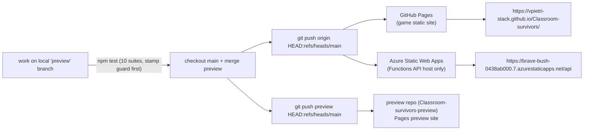

# Deployment & Release Discipline

> **Last verified:** 2026-09-04 · **Part of:** [Classroom-survivors Repo Wiki](README.md)

**Owner files:** `AGENTS.md`, `DEPLOY_VERSION_STAMP.md`, `.github/workflows/azure-static-web-apps-brave-bush-0438ab000.yml`, `package.json`, `test_deploy_stamp_sync.js`, `version.json`, `staticwebapp.config.json`

Two hosting surfaces, one push:



The Pages site URL above is verified against the repo itself: the SWA workflow's stub
`index.html` literally points to it (workflow line 35), `config.js:11` targets the SWA API
hostname, and `staticwebapp.config.json` sets `Access-Control-Allow-Origin:
https://vpietri-stack.github.io`. Note there is **no dedicated Pages workflow file** —
GitHub Pages deploy-from-branch is configured in repo Settings (source: `main`, root), evidenced
by `.nojekyll` at root and the absence of any `pages-build` workflow; the only tracked workflow
is the Azure SWA one.

<!-- VERIFY: the exact Pages configuration (branch + folder) lives in GitHub repo Settings, not in the repo — confirm in the UI if precision is required. A preview repo serves /Classroom-survivors-preview/ (config.js:52 keys TD gating off that path). -->

## 1. GitHub Actions workflows

There is exactly **one** workflow file in the repo:

| | `azure-static-web-apps-brave-bush-0438ab000.yml` |
|---|---|
| Name | **Azure Static Web Apps CI/CD** |
| Triggers | `push` to `main` or `v2-login`; `pull_request` (opened/synchronize/reopened/closed) against those branches |
| Job guard | `github.repository == 'vpietri-stack/Classroom-survivors'` — the **preview repo has no SWA token secret**, so it never deploys Azure (workflow line 18); it is Pages-only |
| What deploys | **API only.** The SWA exists solely to host `/api` Functions; the game is served by GitHub Pages. A minimal app dir `swa_app/` is staged (routes config + stub index + CI-injected `app-config.json`) because uploading the whole repo exceeds the Free tier's 250 MB app limit |
| Steps | checkout → stage `swa_app/` (copies `staticwebapp.config.json`) → inject client app config from secret `APP_CLIENT_KEY` (workflow lines 36–42) → `Azure/static-web-apps-deploy@v1` with `app_location: swa_app`, `api_location: api`, `skip_app_build: true` |
| Secrets used | `AZURE_STATIC_WEB_APPS_API_TOKEN_BRAVE_BUSH_0438AB000`, `GITHUB_TOKEN`, `APP_CLIENT_KEY` (value never in repo) |
| Close-PR job | Second job runs `Azure/static-web-apps-deploy@v1 action: close` on PR close |

Pages and SWA are **separate Actions runs triggered by the same push** to `main` of `origin`
(AGENTS.md "Deploy pipeline"). The Pages build takes ~1–2 min after push; the served
`version.json` has been observed to lag the push by ~90 s (`HANDOFF_SESSION_REFRESH_FIX.md`
round-4 note).

## 2. Branch & remote model

Remotes (verified from `git config`):

| Remote | URL | Role |
|---|---|---|
| `origin` | `https://github.com/vpietri-stack/Classroom-survivors.git` | **LIVE**: GitHub Pages + Azure SWA both build from its `main`. |
| `preview` | `https://github.com/vpietri-stack/Classroom-survivors-preview.git` | **PREVIEW** Pages site (`/Classroom-survivors-preview/` path). |

Branches: local `preview` (working/integration), local `main` (what ships), plus a stale
`feature/ui-mobile-child-friendly`. Gotcha: a local branch `preview` AND remote `preview/main`
both exist → `git` warns "refname 'preview' is ambiguous"; use full refs
`refs/heads/preview`, `refs/remotes/preview/main` (`HANDOFF_SESSION_REFRESH_FIX.md` §1).

**Standard release cycle** (AGENTS.md):

1. Do the work on local `preview`; commit staged paths only (`git add <file> …` — never
   `git add -A`/`git add .`).
2. `npm test` green (root suite) and `cd api && npm test` for backend changes.
3. `git checkout main && git merge preview`.
4. `git push origin HEAD:refs/heads/main` **and** `git push preview HEAD:refs/heads/main`
   (explicit refspec — **not** `git push preview preview`).
5. Keep all four refs equal: `main`, `preview`, `origin/main`, `preview/main`
   (verify with `git rev-parse refs/heads/main refs/heads/preview origin/main preview/main`).

Runtime feature gating is what makes this merge-safe: `TD_ENABLED` / `THREE_TD_ENABLED`
(`config.js:45/61`) are detected **at runtime from the URL path** (preview path or
localhost/file:// or `?td=`/`?3d=`), so a merge never flips a per-branch flag.

## 2b. The version bump checklist (the gate)

Every deploy that clients must pick up requires the **three stamps** to be bumped together —
see [Auth & Versioning](04-auth-versioning.md) for the watchdog mechanics:

1. Pick a stamp `YYYY-MM-DD` + optional lowercase letter (comparison: year → month → day →
   letter). Current: `2026-09-16c`.
2. Set all three: `version.json` `"version"` · `frontend_auth.js` `const APP_VERSION` ·
   `index.html` `frontend_auth.js?v=` (script-tag line ~731).
3. `npm test` must pass — `test_deploy_stamp_sync.js` runs **first** and exits non-zero on any
   drift, so a mismatch cannot ship through the normal gate.
4. Other scripts' `?v=` stamps in index.html: bump the file's stamp too if clients must pick
   up that file immediately (historical stamps are per-file, e.g. `study_mode.js?v=2026-08-26a`).
5. Deploy, then verify live: fetch the served `frontend_auth.js` and confirm `APP_VERSION`
   matches the served `version.json` (allow ~90 s of Pages-build lag).

## 3. The GitHub Pages wedge (known failure mode)

A prior "in progress" Pages deployment blocks the next one:

```
Deployment request failed ... due to in progress deployment. Please cancel <sha> first
```

- The modern Pages Settings UI has **no cancel button**.
- It **self-resolves in ~30–90 min** (the lock rolls forward), or
  `gh run rerun <pages-run-id>` once the lock rolls forward.
- **Do NOT thrash** with repeated pushes — each new push just queues behind the same lock.
- **Do NOT click "Unpublish site"** — that is destructive and unnecessary.
- One rerun after the wedge clears is enough (AGENTS.md; DEPLOY_VERSION_STAMP.md §"If you broke it").
- This bit for real on 2026-08-30: `version.json` was bumped alone, the other two stamps were
  forgotten, and recovery required a full Pages-deploy unstick (AGENTS.md Rule 1).

## 4. GFW reality (mainland-China connectivity)

- GitHub connectivity from mainland China is **lossy**: `git push` to port 443 intermittently
  resets — retry 3–5× with ~1 min gaps; it clears (`HANDOFF_SESSION_REFRESH_FIX.md` §1).
- This is also why the game self-hosts everything (Tailwind, fonts, Font Awesome,
  `lib/tailwind.js` instead of the CDN) and why `asset_cache.js` routes asset downloads through
  the `gh-proxy.com` mirror first on `*.github.io` pages — see [Frontend Core](03-frontend-core.md).
- Release verification curls (`version.json`, served JS) may need retries too.

## 5. Operational gotchas from the handoff history

| Gotcha | Detail |
|---|---|
| Ambiguous refname | Local `preview` vs remote `preview/main` — always use full refs. |
| PowerShell-only hosts | Long one-liners crash PSReadLine and silently drop chained commands; re-verify each ref with short commands after a chained deploy. |
| Push noise | `git push` progress on stderr looks like an error in PowerShell; judge by the `oldsha..newsha HEAD -> main` line. |
| Parallel sessions | A speech-recognition session may commit in the same worktree; check `git status` before staging; leave `api/speech_events_dump_full.json` untracked. |
| Test gate | `npm test` = 10 suites (order in `package.json:7`, stamp-sync first); backend: `cd api && npm test`. |
| Verify deployments | SWA: build record `Ready` + runtime evidence (e.g. archive docs created by live traffic). Pages: fetch `version.json` and grep served `frontend_auth.js` for the stamp. |

## 6. Quick reference: what ships where

| Component | Deployed by | Source | Notes |
|---|---|---|---|
| Game static site | GitHub Pages (repo Settings, deploy from `main`) | `origin/main` | `.nojekyll` present; ~1–2 min build. |
| Preview site | GitHub Pages | `preview` repo `main` | Serves under `/Classroom-survivors-preview/`. |
| Functions API | Azure Static Web Apps CI/CD workflow | `origin/main` (`api/` dir) | Minimal staged app; runtime feature flags from `config.js`. |
| Whisper model + big assets | Not "deployed" — fetched at runtime | `models/`, `sprites/`, `audio_mp3/`, `music/`, `sfx/` | Downloaded via `asset_cache.js` mirror logic / speech engine raw URLs. |

## Update discipline

Any agent that changes code covered by this page must update this page in the same commit. The wiki is the single source of truth; skills/memory hold only behavior rules and point here.